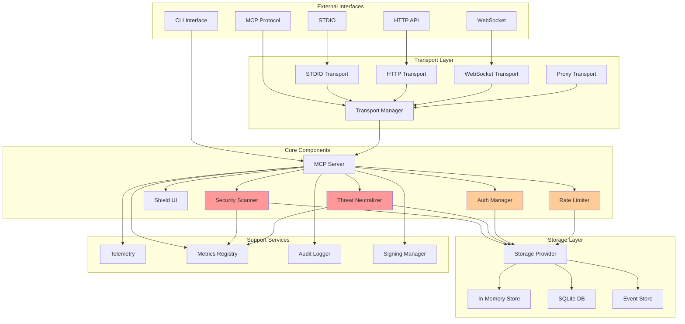
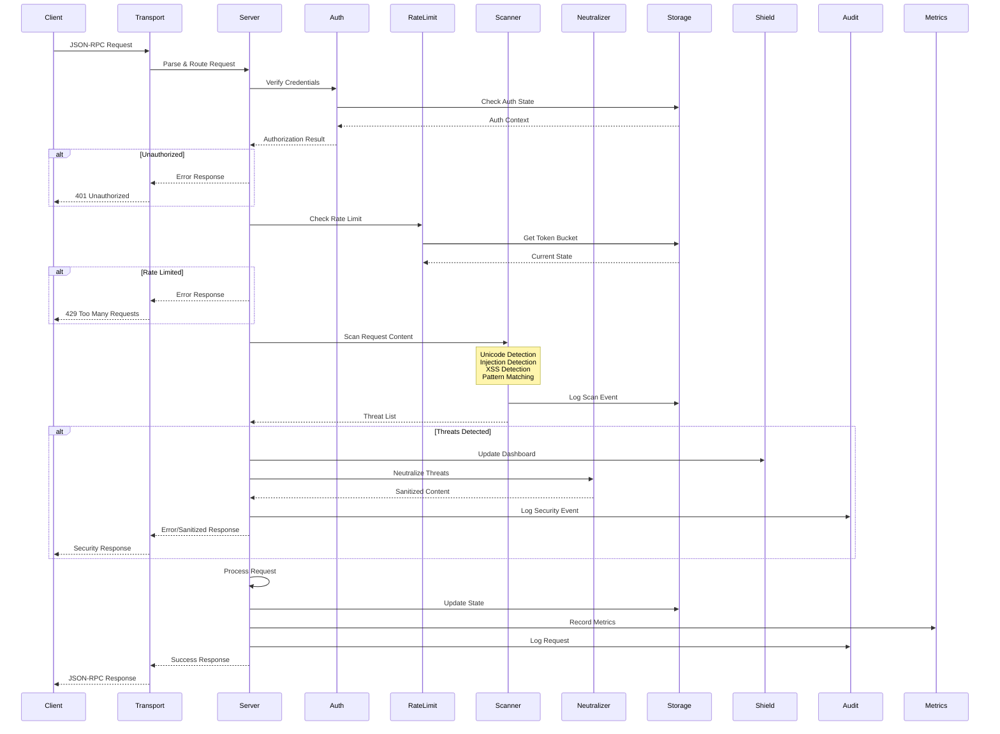
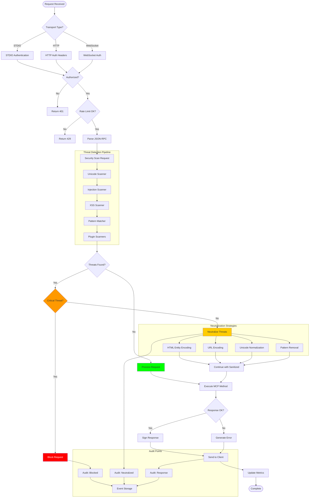
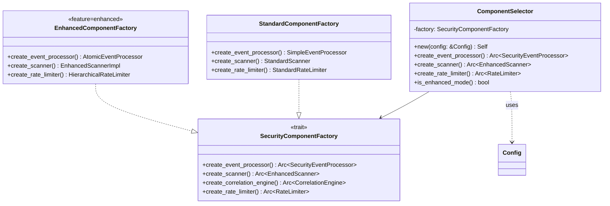
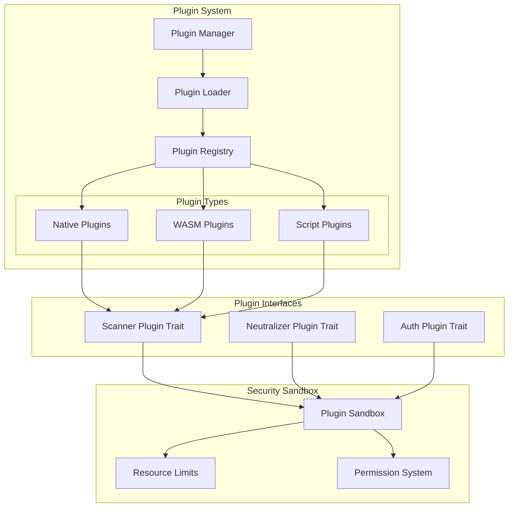
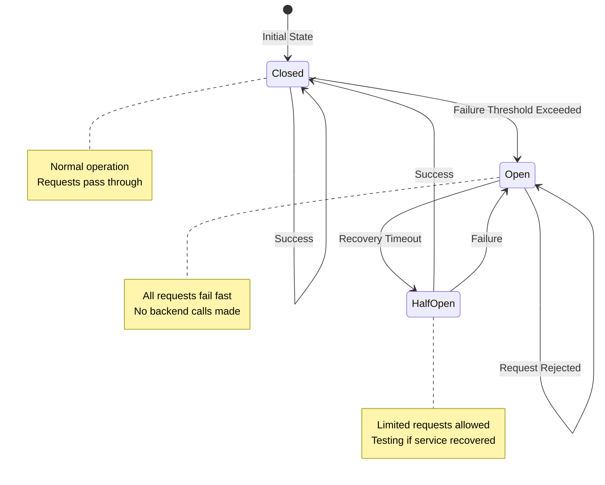

```mermaid
graph LR
    subgraph "Input Layer"
        Raw[Raw Input]
        JSON[JSON Data]
        Text[Text Data]
    end
    
    subgraph "Transport Security"
        TLS[TLS Encryption]
        Auth[Authentication]
        Sign[Signature Verification]
    end
    
    subgraph "Application Security"
        Rate[Rate Limiting]
        Scan[Threat Scanning]
        Neutral[Neutralization]
    end
    
    subgraph "Processing"
        MCP[MCP Handler]
        Tools[Tool Execution]
        Response[Response Generation]
    end
    
    subgraph "Output Security"
        Sanitize[Output Sanitization]
        SignOut[Response Signing]
        Encrypt[Encryption]
    end
    
    Raw --> TLS
    JSON --> TLS
    Text --> TLS
    
    TLS --> Auth
    Auth --> Sign
    Sign --> Rate
    
    Rate --> Scan
    Scan --> Neutral
    Neutral --> MCP
    
    MCP --> Tools
    Tools --> Response
    Response --> Sanitize
    
    Sanitize --> SignOut
    SignOut --> Encrypt
    Encrypt --> Client[Client]
    
    style Scan fill:#ff9999
    style Neutral fill:#ffcc99
    style Rate fill:#99ccff
```

# KindlyGuard Architecture Diagrams

This document contains comprehensive visual diagrams of the KindlyGuard security-focused MCP server architecture using Mermaid syntax.

## 1. High-Level System Architecture

## 2. Detailed Component Interaction Diagram

## 3. Trait Hierarchy Diagram

```mermaid
classDiagram
    %% Core Traits
    class SecurityScanner {
        <<trait>>
        +scan_text(text: &str) Vec~Threat~
        +scan_json(json: &Value) Vec~Threat~
    }
    
    class EnhancedScanner {
        <<trait>>
        +enhanced_scan(data: &[u8]) Vec~Threat~
        +get_metrics() ScannerMetrics
        +preload_patterns(patterns: &[String])
    }
    
    class ThreatNeutralizer {
        <<trait>>
        +neutralize(input: &str, threats: &[Threat]) NeutralizeResult
        +get_capabilities() Vec~NeutralizationCapability~
    }
    
    class StorageProvider {
        <<trait>>
        +store_event(event: &SecurityEvent) EventId
        +get_event(id: &EventId) Option~SecurityEvent~
        +query_events(filter: &EventFilter) Vec~SecurityEvent~
    }
    
    class RateLimiter {
        <<trait>>
        +check_rate_limit(key: &RateLimitKey) RateLimitDecision
        +record_request(key: &RateLimitKey)
        +apply_penalty(client_id: &str, factor: f32)
    }
    
    class SecurityEventProcessor {
        <<trait>>
        +process_event(event: SecurityEvent) EventHandle
        +get_stats() ProcessorStats
        +get_insights(client_id: &str) SecurityInsights
    }
    
    class EventBufferTrait {
        <<trait>>
        +enqueue_event(endpoint_id: u32, data: &[u8], priority: Priority) u64
        +get_endpoint_stats(endpoint_id: u32) EndpointStats
    }
    
    %% Standard Implementations
    class StandardScanner {
        +unicode_scanner: UnicodeScanner
        +injection_scanner: InjectionScanner
        +xss_scanner: XssScanner
    }
    
    class StandardNeutralizer {
        +html_encoder: HtmlEncoder
        +url_encoder: UrlEncoder
        +unicode_normalizer: UnicodeNormalizer
    }
    
    class InMemoryStorage {
        +events: HashMap
        +rate_limits: HashMap
        +snapshots: HashMap
    }
    
    class StandardRateLimiter {
        +buckets: HashMap
        +config: RateLimitConfig
    }
    
    class SimpleEventProcessor {
        +events: Vec~SecurityEvent~
        +max_events: usize
    }
    
    %% Enhanced Implementations (Feature-gated)
    class EnhancedScannerImpl {
        <<feature=enhanced>>
        +pattern_cache: PatternCache
        +simd_scanner: SimdScanner
        +ml_detector: MlDetector
    }
    
    class EnhancedNeutralizer {
        <<feature=enhanced>>
        +context_aware: ContextEngine
        +adaptive_rules: AdaptiveRules
    }
    
    class EnhancedStorage {
        <<feature=enhanced>>
        +write_ahead_log: WAL
        +compression: Compressor
        +encryption: Encryptor
    }
    
    class HierarchicalRateLimiter {
        <<feature=enhanced>>
        +global_limiter: GlobalLimiter
        +per_client_limiter: ClientLimiter
        +adaptive_limits: AdaptiveLimits
    }
    
    class AtomicEventProcessor {
        <<feature=enhanced>>
        +event_buffer: AtomicEventBuffer
        +correlation_engine: CorrelationEngine
    }
    
    %% Relationships
    StandardScanner ..|> SecurityScanner
    StandardScanner ..|> EnhancedScanner
    EnhancedScannerImpl ..|> EnhancedScanner
    
    StandardNeutralizer ..|> ThreatNeutralizer
    EnhancedNeutralizer ..|> ThreatNeutralizer
    
    InMemoryStorage ..|> StorageProvider
    EnhancedStorage ..|> StorageProvider
    
    StandardRateLimiter ..|> RateLimiter
    HierarchicalRateLimiter ..|> RateLimiter
    
    SimpleEventProcessor ..|> SecurityEventProcessor
    AtomicEventProcessor ..|> SecurityEventProcessor
    AtomicEventProcessor --> EventBufferTrait
```

## 4. Security Flow Diagram

## 5. Component Factory Pattern

## 6. Data Flow Through Security Layers

## 7. Plugin Architecture

## 8. Resilience Architecture

## Notes

- **Security First**: All data flows through multiple security checkpoints
- **Type Safety**: Threats are represented as typed enums, never strings
- **Trait-Based**: Clean separation between interfaces and implementations
- **Feature Gating**: Enhanced implementations are behind feature flags
- **Plugin Support**: Extensible architecture for custom security modules
- **Resilience**: Circuit breakers and retry logic for fault tolerance
- **Audit Trail**: All security events are logged for compliance

The architecture emphasizes defense-in-depth with multiple overlapping security layers, ensuring that even if one layer is compromised, others provide protection.