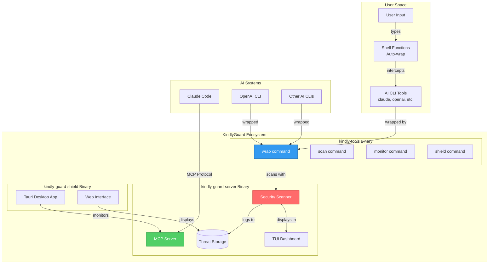
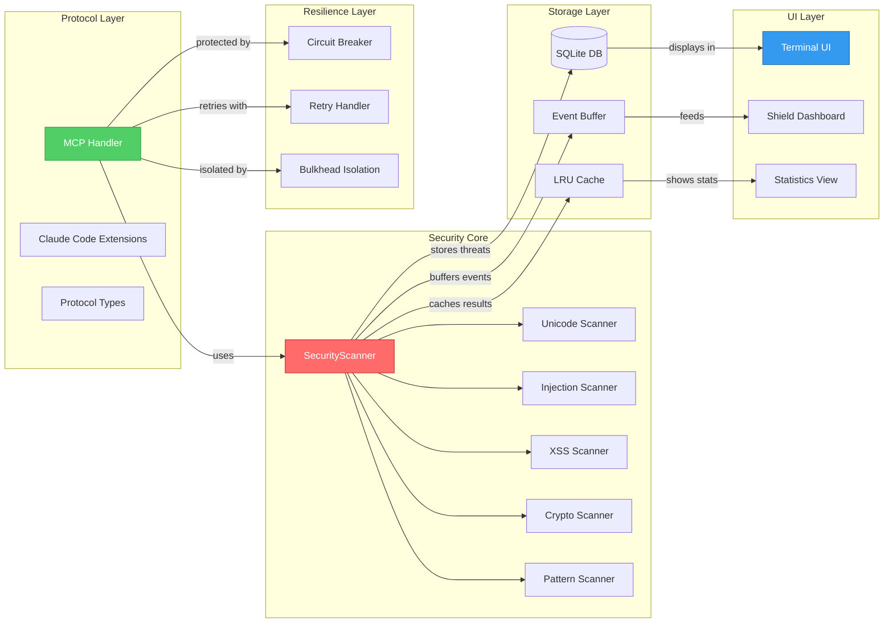
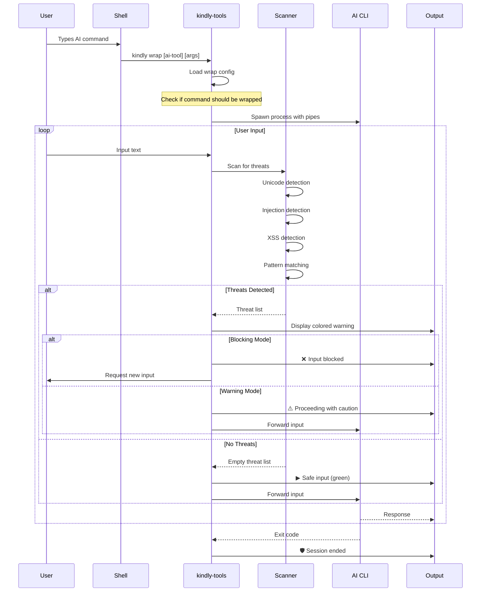
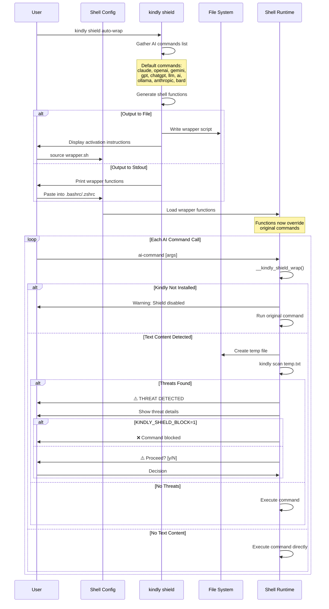
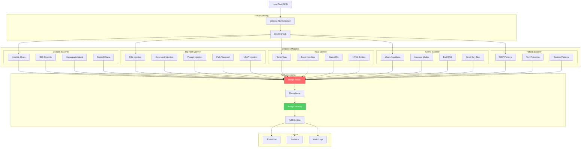
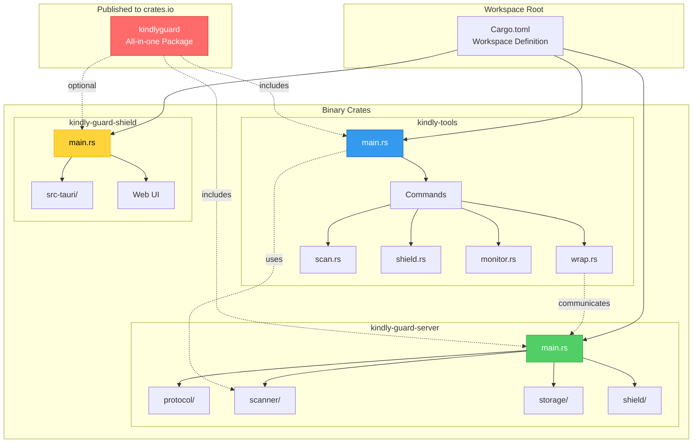
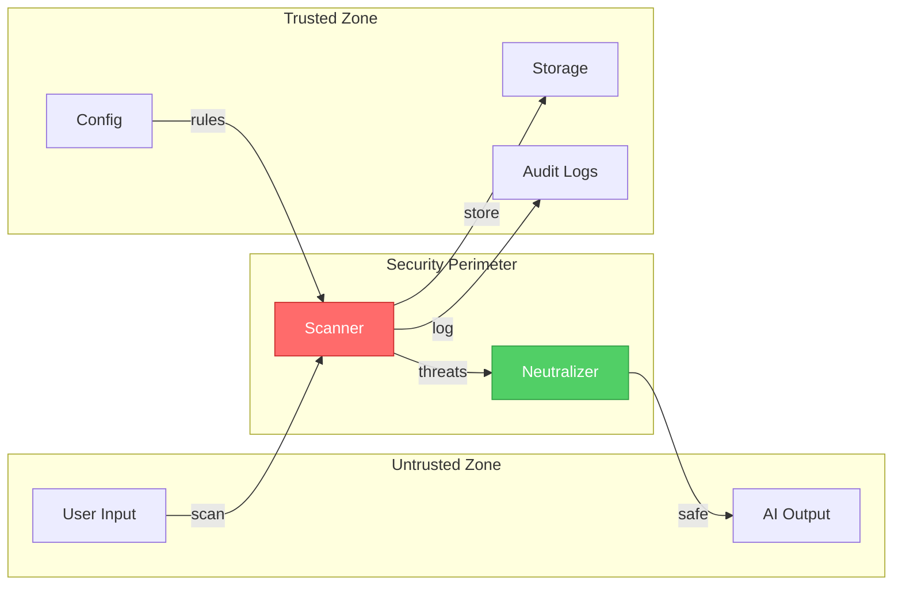

# KindlyGuard Architecture Diagrams v0.11.0

This document provides comprehensive architecture diagrams for the KindlyGuard system, illustrating the component structure, data flows, and integration patterns.

## Table of Contents

1. [System Overview](#system-overview)
2. [Component Interaction](#component-interaction)
3. [Data Flow - Wrap Command](#data-flow-wrap-command)
4. [Shield Auto-Wrap Sequence](#shield-auto-wrap-sequence)
5. [Threat Detection Pipeline](#threat-detection-pipeline)
6. [Binary Structure](#binary-structure)
7. [MCP Protocol Flow](#mcp-protocol-flow)

## System Overview



## Component Interaction



## Data Flow - Wrap Command



## Shield Auto-Wrap Sequence



## Threat Detection Pipeline



## Binary Structure



## MCP Protocol Flow

```mermaid
sequenceDiagram
    participant Claude as Claude Code
    participant Server as kindly-guard-server
    participant Handler as MCP Handler
    participant Scanner as Security Scanner
    participant Storage as Storage Layer
    participant Shield as Shield Status
    
    Claude->>Server: MCP Connection (stdio/TCP)
    Server->>Handler: Initialize protocol
    
    Claude->>Handler: initialize request
    Handler->>Handler: Register tools
    Handler->>Handler: Setup capabilities
    Handler-->>Claude: InitializeResult
    
    Note over Claude,Shield: Tool Registration Phase
    
    Claude->>Handler: tools/list
    Handler-->>Claude: Available tools:<br/>- scan_text<br/>- scan_json<br/>- shield_status<br/>- shield_control
    
    Note over Claude,Shield: Normal Operation
    
    loop Tool Calls
        Claude->>Handler: tools/call
        Handler->>Scanner: Validate request
        
        alt scan_text Tool
            Claude->>Handler: {tool: "scan_text", text: "..."}
            Handler->>Scanner: scan_text(input)
            Scanner->>Scanner: Run detection pipeline
            Scanner-->>Handler: Threat list
            Handler->>Storage: Log threats
            Handler->>Shield: Update statistics
            Handler-->>Claude: ScanResult
        else scan_json Tool
            Claude->>Handler: {tool: "scan_json", json: {...}}
            Handler->>Scanner: scan_json(input)
            Scanner->>Scanner: Recursive scan
            Scanner-->>Handler: Threat list
            Handler->>Storage: Log threats
            Handler-->>Claude: ScanResult
        else shield_status Tool
            Claude->>Handler: {tool: "shield_status"}
            Handler->>Shield: Get current status
            Shield-->>Handler: Statistics & state
            Handler-->>Claude: ShieldStatus
        else shield_control Tool
            Claude->>Handler: {tool: "shield_control", action: "..."}
            Handler->>Shield: Execute action
            Shield-->>Handler: Action result
            Handler-->>Claude: ControlResult
        end
        
        Note over Handler,Shield: Async notifications
        
        Shield-->>Handler: Status change
        Handler-->>Claude: notifications/shield_status
    end
    
    Claude->>Handler: shutdown
    Handler->>Storage: Flush pending
    Handler->>Shield: Save state
    Handler-->>Claude: Acknowledged
    
    style Scanner fill:#ff6b6b,stroke:#c92a2a,color:#fff
    style Handler fill:#51cf66,stroke:#2f9e44,color:#fff
    style Shield fill:#339af0,stroke:#1864ab,color:#fff
```

## Integration Points

### 1. kindly-tools Integration with kindly-guard-server

The `kindly-tools` binary provides user-facing commands that integrate with the core `kindly-guard-server`:

- **Direct Library Usage**: The `scan` command uses the `SecurityScanner` from `kindly-guard-server` as a library dependency
- **Process Communication**: The `wrap` command spawns AI tools as child processes and intercepts I/O
- **File System**: Commands share configuration files and threat pattern definitions
- **Network (Future)**: Plans for `kindly-tools` to connect to remote `kindly-guard-server` instances

### 2. MCP Protocol Extensions

KindlyGuard extends the standard MCP protocol with Claude Code specific features:

- **Shield Status Notifications**: Real-time threat alerts pushed to Claude Code
- **Binary Protocol (Enhanced Mode)**: High-performance binary encoding for large payloads
- **Custom Error Codes**: Security-specific error types for better handling

### 3. Security Boundaries



## Performance Optimizations

### 1. Zero-Copy Scanning
- Text is scanned in-place without allocation
- SIMD instructions for Unicode detection (x86_64)
- Memory-mapped files for large inputs

### 2. Caching Strategy
- LRU cache for repeated scans
- Pattern compilation cache
- Threat deduplication cache

### 3. Async Architecture
- Non-blocking I/O throughout
- Parallel scanner execution
- Event-driven notifications

## Configuration Flow

```mermaid
graph TD
    Default[Default Config]
    System[/etc/kindly-guard/config.toml]
    User[~/.config/kindly-guard/config.toml]
    Env[Environment Variables]
    Runtime[Runtime Config]
    
    Default --> Runtime
    System --> Runtime
    User --> Runtime
    Env --> Runtime
    
    Runtime --> Scanner[Scanner Config]
    Runtime --> Server[Server Config]
    Runtime --> UI[UI Config]
    
    Scanner --> Patterns[Pattern Files]
    Scanner --> Rules[Security Rules]
    
    style Runtime fill:#51cf66,stroke:#2f9e44,color:#fff
```

## Deployment Scenarios

### 1. Local Development
- Single binary: `kindly-tools` for all CLI operations
- MCP server runs embedded within Claude Code
- Shield provides real-time monitoring

### 2. Team Environment
- Central `kindly-guard-server` instance
- Team members use `kindly-tools` to connect
- Shared threat intelligence database

### 3. CI/CD Integration
- `kindly scan` in pre-commit hooks
- `kindly-guard-server` as security gate
- Automated threat reporting

## Future Architecture Considerations

1. **Plugin System**: Dynamic loading of custom scanners
2. **Distributed Mode**: Multiple scanner nodes with load balancing
3. **ML Integration**: Anomaly detection using learned patterns
4. **Cloud Native**: Kubernetes operators and service mesh integration
5. **Language SDKs**: Native bindings for Python, Go, TypeScript

---

*Generated for KindlyGuard v0.11.0 - Architecture subject to enhancement in future releases*