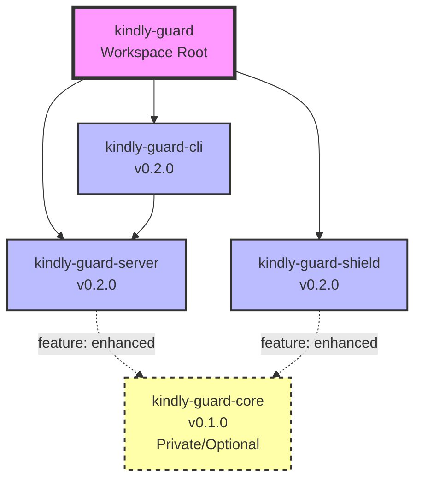
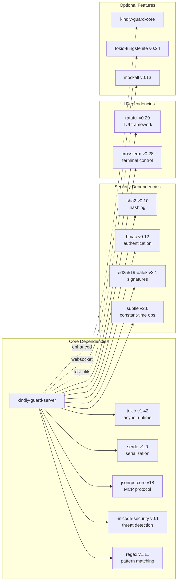
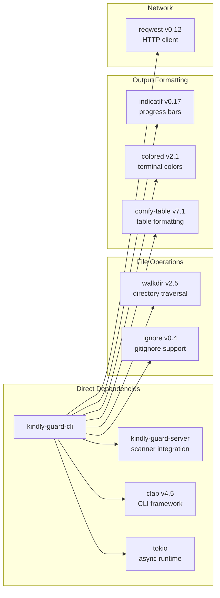
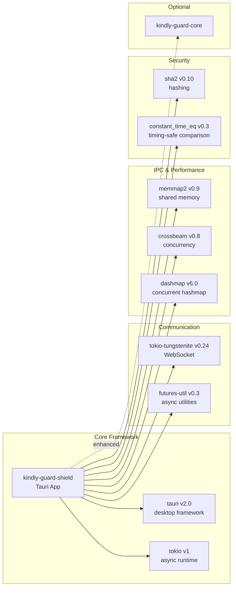
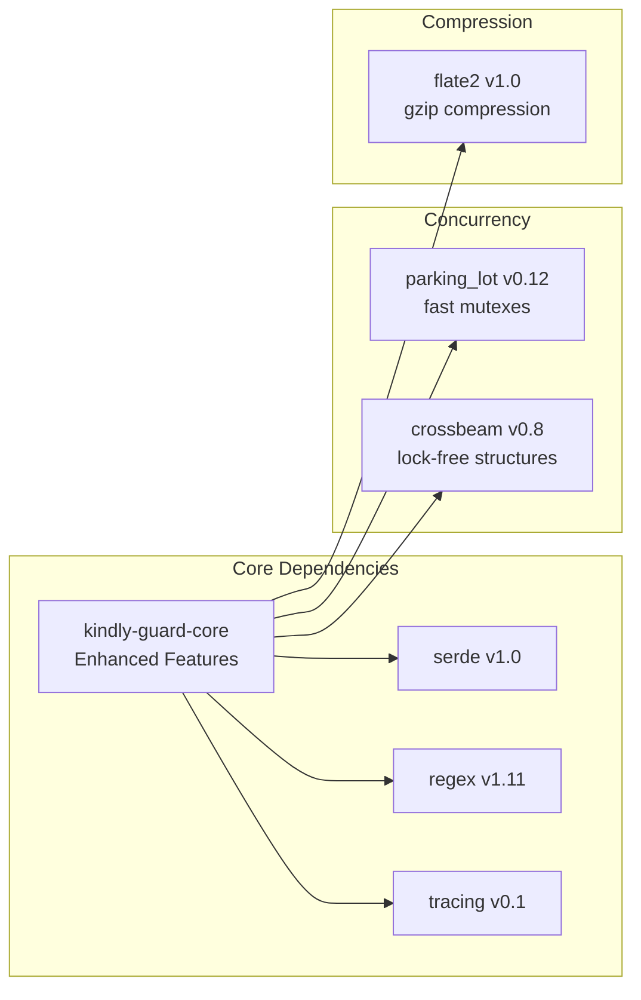
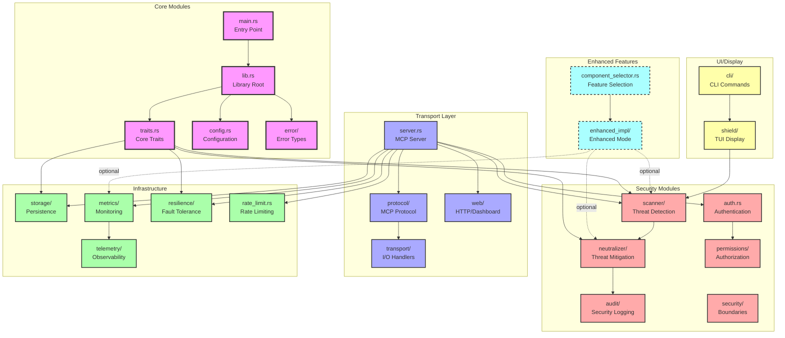
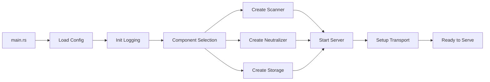

# KindlyGuard Dependency Analysis

## Executive Summary

This document provides a comprehensive analysis of the KindlyGuard project's dependency structure, including internal module dependencies, external crate dependencies, and critical dependency paths. The analysis reveals a well-structured workspace with clear separation of concerns and optional enhanced features.

## Workspace Structure

The KindlyGuard project is organized as a Rust workspace with the following crates:

```
kindly-guard/ (workspace root)
├── kindly-guard-server/     # Main MCP server implementation
├── kindly-guard-cli/        # Command-line interface tool  
├── kindly-guard-shield/     # Tauri desktop application
├── kindly-guard-core/       # Private enhanced features (optional)
└── crates-io-package/       # Public crate for distribution
```

## Dependency Graphs

### 1. Overall Workspace Dependency Graph



### 2. kindly-guard-server Dependencies



### 3. kindly-guard-cli Dependencies



### 4. kindly-guard-shield Dependencies



### 5. kindly-guard-core Dependencies (Private/Enhanced)



## Critical Dependency Paths

### 1. Security Path
```
Input → Scanner (unicode-security, regex) → Neutralizer → Audit → Output
```

### 2. Protocol Path
```
Client Request → Transport (tokio) → Auth (hmac, ed25519) → Protocol (jsonrpc) → Handler
```

### 3. Enhancement Path
```
Standard Implementation → Feature Flag Check → kindly-guard-core → Enhanced Implementation
```

## External Crate Analysis

### Security-Critical Dependencies

1. **unicode-security (0.1)**: Detects Unicode-based attacks
   - Used by: kindly-guard-server
   - Critical for: Homograph attacks, bidi overrides, zero-width characters

2. **regex (1.11)**: Pattern matching with size limits
   - Used by: kindly-guard-server, kindly-guard-core
   - Critical for: Injection detection, pattern-based threats

3. **sha2 (0.10)**: Cryptographic hashing
   - Used by: kindly-guard-server, kindly-guard-shield
   - Critical for: Integrity checks, authentication

4. **hmac (0.12)**: Message authentication
   - Used by: kindly-guard-server
   - Critical for: Request validation

5. **ed25519-dalek (2.1)**: Digital signatures
   - Used by: kindly-guard-server
   - Critical for: Cryptographic signing

### Performance-Critical Dependencies

1. **tokio (1.42)**: Async runtime
   - Used by: All crates
   - Critical for: Concurrent request handling

2. **parking_lot (0.12)**: Fast synchronization primitives
   - Used by: kindly-guard-server, kindly-guard-core
   - Critical for: Lock-free statistics, fast mutexes

3. **crossbeam (0.8)**: Lock-free data structures
   - Used by: kindly-guard-core, kindly-guard-shield
   - Critical for: High-performance concurrent operations

4. **dashmap (6.0)**: Concurrent hashmap
   - Used by: kindly-guard-shield
   - Critical for: Thread-safe state management

## Circular Dependencies

**No circular dependencies detected** in the workspace. The dependency flow is strictly hierarchical:

```
cli → server ← core (optional)
shield ← core (optional)
```

## Dependency Security Considerations

### 1. Supply Chain Security

- All dependencies are from crates.io with verified checksums
- No git dependencies or path dependencies (except internal workspace)
- Regular `cargo audit` checks recommended

### 2. Version Pinning

- Major versions are pinned for stability
- Minor versions allow updates for security patches
- Workspace-level dependency management ensures consistency

### 3. Optional Dependencies

- Enhanced features are behind feature flags
- Test utilities are dev-dependencies only
- WebSocket support is optional

## Dependency Update Strategy

### 1. Regular Dependencies
- Update minor versions monthly
- Update patch versions immediately for security
- Major version updates require testing

### 2. Security Dependencies
- Monitor advisories via `cargo audit`
- Prioritize updates for crypto libraries
- Test thoroughly after updates

### 3. Enhanced Dependencies
- kindly-guard-core follows internal release cycle
- Backward compatibility maintained
- Feature flag ensures graceful degradation

## Build Impact Analysis

### 1. Compile Time
- Full build with all features: ~3-5 minutes
- Incremental builds: <30 seconds
- Enhanced features add ~20% to build time

### 2. Binary Size
- kindly-guard-server: ~15MB (release)
- kindly-guard-cli: ~8MB (release)
- kindly-guard-shield: ~25MB (with Tauri runtime)

### 3. Runtime Dependencies
- No dynamic linking except system libraries
- Self-contained binaries
- Optional features increase memory usage by ~10%

## Recommendations

1. **Dependency Hygiene**
   - Run `cargo audit` in CI/CD pipeline
   - Use `cargo-deny` for policy enforcement
   - Regular dependency updates

2. **Feature Management**
   - Keep enhanced features optional
   - Document feature combinations
   - Test all feature permutations

3. **Performance Monitoring**
   - Track build times in CI
   - Monitor binary sizes
   - Benchmark critical paths

4. **Security Hardening**
   - Enable all compiler security features
   - Use `cargo-crev` for dependency reviews
   - Implement dependency scanning

## Conclusion

The KindlyGuard project demonstrates excellent dependency management with:
- Clear separation between crates
- Optional enhanced features
- No circular dependencies
- Security-focused dependency selection
- Performance-optimized architecture

The modular design allows for flexible deployment scenarios while maintaining security and performance standards.

## Module-Level Dependencies (kindly-guard-server)

### Internal Module Dependency Graph



### Key Module Relationships

#### 1. Scanner Module Dependencies
```
scanner/
├── mod.rs (orchestrator)
├── unicode.rs → unicode-security crate
├── injection.rs → regex patterns
├── xss_scanner.rs → HTML/JS patterns
├── patterns.rs → custom patterns
└── sync_wrapper.rs → async/sync bridge
```

#### 2. Neutralizer Module Dependencies
```
neutralizer/
├── mod.rs (trait + factory)
├── standard.rs → basic implementation
├── enhanced.rs → kindly-guard-core (optional)
├── rate_limited.rs → rate_limit module
├── security_aware.rs → scanner integration
├── traced.rs → telemetry integration
├── validation.rs → input validation
├── rollback.rs → transaction support
├── recovery.rs → error recovery
├── health.rs → health monitoring
└── metrics.rs → performance metrics
```

#### 3. Transport Module Dependencies
```
transport/
├── mod.rs (trait definitions)
├── stdio.rs → MCP standard I/O
├── websocket.rs → tokio-tungstenite
├── http.rs → axum framework
├── proxy.rs → request forwarding
├── claude_code.rs → Claude Code bridge
└── enhanced.rs → binary protocol (optional)
```

#### 4. Storage Module Dependencies
```
storage/
├── mod.rs (trait + factory)
├── memory.rs → in-memory cache
└── enhanced.rs → persistent storage (optional)
```

### Module Communication Patterns

1. **Request Flow**:
   ```
   Transport → Server → Auth → Scanner → Neutralizer → Response
   ```

2. **Event Flow**:
   ```
   Scanner → Audit → Storage
   Scanner → Metrics → Telemetry
   ```

3. **Configuration Flow**:
   ```
   Config → ComponentSelector → Enhanced/Standard Implementation
   ```

4. **Error Propagation**:
   ```
   Any Module → Error Types → Server → Transport → Client
   ```

### Critical Internal Dependencies

1. **traits.rs**: Defines core abstractions used throughout
   - SecurityScanner trait
   - ThreatNeutralizer trait
   - EventBufferTrait
   - RateLimiter trait
   - StorageBackend trait

2. **component_selector.rs**: Runtime feature selection
   - Determines standard vs enhanced implementations
   - Manages feature flags dynamically

3. **error/mod.rs**: Centralized error handling
   - KindlyError enum
   - Error conversion traits
   - Context propagation

4. **config.rs**: Configuration management
   - Loaded at startup
   - Influences all module behavior
   - Supports runtime reloading

### Module Initialization Order



This modular architecture ensures:
- Clear separation of concerns
- Easy testing of individual modules
- Flexible deployment configurations
- Optional enhanced features without affecting core functionality