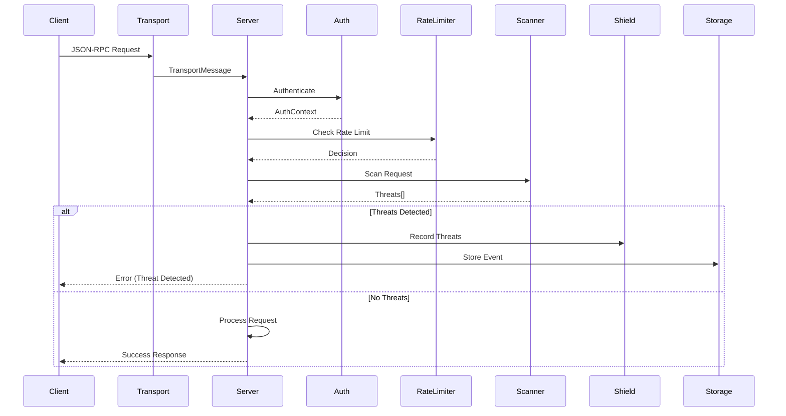
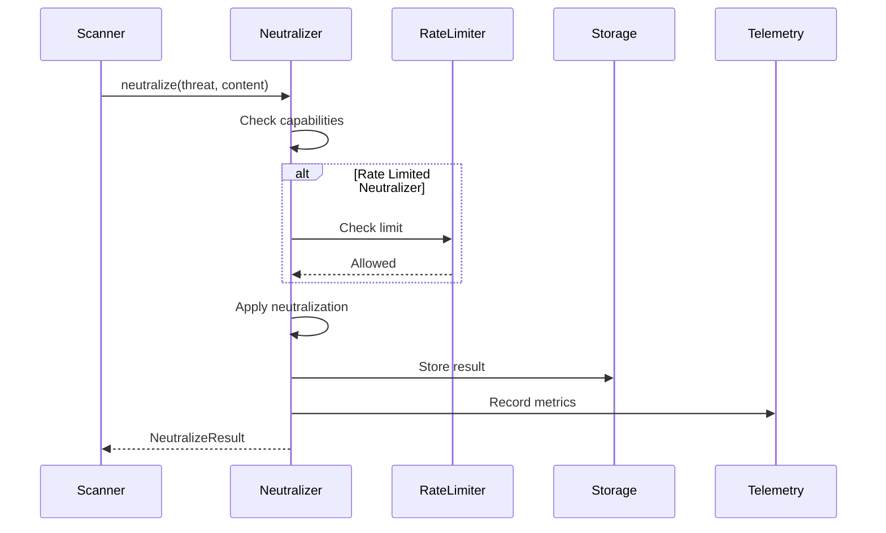
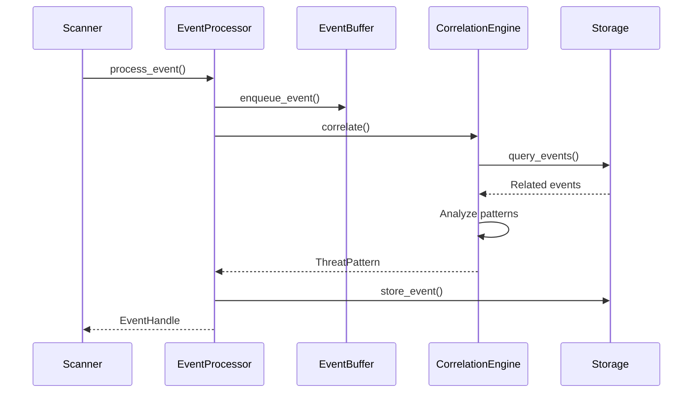

# KindlyGuard Module Interactions

This document maps the interactions between different modules within the KindlyGuard security server, focusing on how components communicate and depend on each other.

## Table of Contents
1. [Architecture Overview](#architecture-overview)
2. [Core Trait System](#core-trait-system)
3. [Module Dependencies](#module-dependencies)
4. [Component Integration](#component-integration)
5. [Data Flow Patterns](#data-flow-patterns)
6. [Sequence Diagrams](#sequence-diagrams)
7. [Key Design Patterns](#key-design-patterns)

## Architecture Overview

KindlyGuard follows a **trait-based architecture** that enables:
- Clean separation between interfaces and implementations
- Easy swapping between standard and enhanced implementations
- Testability through mock implementations
- Hidden proprietary technology behind trait abstractions

### Core Principles
1. **Trait-First Design**: All major components are defined as traits in `src/traits.rs`
2. **Factory Pattern**: Components are created through factories that select implementations
3. **Dependency Injection**: Components receive dependencies through constructor injection
4. **Loose Coupling**: Modules communicate through well-defined trait interfaces

## Core Trait System

### Primary Traits (`src/traits.rs`)

```
┌─────────────────────────────────────────────────────────────────┐
│                          Core Traits                             │
├─────────────────────┬────────────────────┬─────────────────────┤
│ SecurityScannerTrait│ ThreatNeutralizer  │ Transport           │
│ - scan_text()       │ - neutralize()     │ - send()            │
│ - scan_json()       │ - can_neutralize() │ - receive()         │
├─────────────────────┼────────────────────┼─────────────────────┤
│ StorageProvider     │ RateLimiter        │ SecurityEventProc   │
│ - store_event()     │ - check_rate_limit()│ - process_event()  │
│ - query_events()    │ - apply_penalty()  │ - get_insights()    │
├─────────────────────┼────────────────────┼─────────────────────┤
│ CircuitBreakerTrait │ RetryStrategyTrait │ HealthCheckTrait    │
│ - call()            │ - execute()        │ - check()           │
│ - state()           │ - should_retry()   │ - detailed_check()  │
└─────────────────────┴────────────────────┴─────────────────────┘
```

### Shared Data Structures

```rust
// Threats (scanner → neutralizer → storage)
pub struct Threat {
    pub threat_type: ThreatType,
    pub severity: Severity,
    pub location: Location,
    pub description: String,
}

// Security Events (all modules → event processor → storage)
pub struct SecurityEvent {
    pub event_type: String,
    pub client_id: String,
    pub timestamp: u64,
    pub metadata: serde_json::Value,
}

// Transport Messages (transport → server → scanner)
pub struct TransportMessage {
    pub id: String,
    pub payload: serde_json::Value,
    pub metadata: TransportMetadata,
}
```

## Module Dependencies

### 1. Scanner Module (`src/scanner/`)

**Dependencies:**
- `traits::SecurityScannerTrait` - Main interface
- `traits::SecurityEventProcessor` - For enhanced correlation
- `plugins::PluginManagerTrait` - For plugin-based scanning

**Dependents:**
- `server::McpServer` - Uses scanner for threat detection
- `neutralizer` - Receives threats to neutralize
- `shield` - Displays detected threats

**Internal Structure:**
```
scanner/
├── mod.rs          # SecurityScanner orchestrator
├── unicode.rs      # UnicodeScanner
├── injection.rs    # InjectionScanner
├── xss_scanner.rs  # XssScanner trait + implementations
└── patterns.rs     # ThreatPatterns
```

### 2. Neutralizer Module (`src/neutralizer/`)

**Dependencies:**
- `scanner::Threat` - Input for neutralization
- `traits::RateLimiter` - For rate-limited neutralization
- `telemetry::DistributedTracingProvider` - For traced neutralization

**Dependents:**
- `server::McpServer` - Could use for auto-remediation
- `storage` - Stores neutralization history

**Decorator Chain:**
```
ThreatNeutralizer (trait)
    ├── StandardNeutralizer (base)
    ├── EnhancedNeutralizer (base, feature-gated)
    └── Decorators:
        ├── ResilientNeutralizer (recovery)
        ├── RollbackNeutralizer (undo support)
        ├── RateLimitedNeutralizer (throttling)
        ├── HealthMonitoredNeutralizer (health checks)
        └── TracedNeutralizer (distributed tracing)
```

### 3. Transport Module (`src/transport/`)

**Dependencies:**
- `server::MessageHandler` - For message processing
- `traits::SecurityScannerTrait` - Security scanning of messages

**Dependents:**
- `server::McpServer` - Primary consumer
- `daemon` - For different transport modes

**Transport Types:**
```
transport/
├── stdio.rs      # StdioTransport (default)
├── http.rs       # HttpTransport
├── websocket.rs  # WebSocketTransport
├── proxy.rs      # ProxyTransport
└── enhanced.rs   # GrpcTransport (feature-gated)
```

### 4. Storage Module (`src/storage/`)

**Dependencies:**
- `traits::SecurityEvent` - Primary data type stored
- `scanner::Threat` - Threat storage

**Dependents:**
- `traits::SecurityEventProcessor` - Stores/retrieves events
- `traits::RateLimiter` - Persists rate limit state
- `traits::CorrelationEngine` - Stores correlation windows

**Storage Hierarchy:**
```
StorageProvider (trait)
    ├── InMemoryStorage (default)
    ├── EnhancedStorage (feature-gated)
    └── Future: FileStorage, RocksDbStorage, etc.
```

## Component Integration

### ComponentManager (`src/component_selector.rs`)

The `ComponentManager` is the central integration point that:

1. **Creates all components** based on configuration
2. **Selects implementations** (standard vs enhanced)
3. **Wires dependencies** between components
4. **Provides unified access** to all subsystems

```rust
ComponentManager {
    event_processor: Arc<dyn SecurityEventProcessor>,
    scanner: Arc<dyn EnhancedScanner>,
    correlation_engine: Arc<dyn CorrelationEngine>,
    rate_limiter: Arc<dyn RateLimiter>,
    permission_manager: Arc<dyn ToolPermissionManager>,
    telemetry_provider: Arc<dyn TelemetryProvider>,
    storage_provider: Arc<dyn StorageProvider>,
    plugin_manager: Arc<dyn PluginManagerTrait>,
    audit_logger: Arc<dyn AuditLogger>,
    threat_neutralizer: Arc<dyn ThreatNeutralizer>,
}
```

### Server Integration (`src/server.rs`)

The `McpServer` integrates components:

```rust
McpServer {
    scanner: Arc<SecurityScanner>,        // Concrete scanner with sub-scanners
    shield: Arc<Shield>,                  // UI component
    component_manager: Arc<ComponentManager>, // All other components
    // ... auth, signing, sessions ...
}
```

## Data Flow Patterns

### 1. Request Processing Flow

```
Client Request → Transport → Server → Scanner → Response
                                ↓
                          Rate Limiter
                                ↓
                          Event Processor → Storage
                                ↓
                            Shield UI
```

### 2. Threat Detection Flow

```
Input Text/JSON → SecurityScanner
                      ↓
            ┌─────────┴─────────┬──────────────┐
      UnicodeScanner   InjectionScanner   XssScanner
            ↓                   ↓               ↓
        Threats → Aggregation → Shield Display
                      ↓
                Event Processor → Correlation Engine
                      ↓
                Storage Provider
```

### 3. Enhanced Mode Flow

```
When enhanced feature is enabled:

Request → Scanner (with EventProcessor)
             ↓
    Event Buffer (AtomicEventBuffer)
             ↓
    Correlation Analysis
             ↓
    Pattern Detection → Alerts
```

## Sequence Diagrams

### 1. MCP Request Handling



### 2. Threat Neutralization



### 3. Enhanced Event Processing



## Key Design Patterns

### 1. Trait-Based Plugin Architecture

All major components use traits to enable:
- **Standard implementations** - Open source, full functionality
- **Enhanced implementations** - Performance optimized, feature-gated
- **Mock implementations** - For testing

### 2. Decorator Pattern

Used extensively in neutralizer module:
```rust
// Base neutralizer wrapped with decorators
let neutralizer = StandardNeutralizer::new(config);
let neutralizer = ResilientNeutralizer::new(neutralizer);
let neutralizer = RateLimitedNeutralizer::new(neutralizer);
let neutralizer = TracedNeutralizer::new(neutralizer);
```

### 3. Factory Pattern

Component creation through factories:
```rust
trait SecurityComponentFactory {
    fn create_scanner(&self, config: &Config) -> Arc<dyn Scanner>;
    fn create_rate_limiter(&self, config: &Config) -> Arc<dyn RateLimiter>;
    // ...
}
```

### 4. Dependency Injection

Components receive dependencies through constructors:
```rust
impl SecurityEventProcessor {
    pub fn new(
        storage: Arc<dyn StorageProvider>,
        correlation_engine: Arc<dyn CorrelationEngine>,
    ) -> Self {
        // ...
    }
}
```

### 5. Event-Driven Architecture

Security events flow through the system:
- Scanner detects threats → Events
- Rate limiter triggers → Events
- Authentication success/failure → Events
- All events → EventProcessor → Storage → Analysis

## Module Coupling Analysis

### Tight Coupling (Intentional)
- `Scanner` ↔ `Threat` types - Domain objects
- `Server` ↔ `ComponentManager` - Central integration
- `Neutralizer` decorators - Chain of responsibility

### Loose Coupling (By Design)
- All modules ↔ Trait interfaces
- Storage ↔ Other modules (via traits)
- Transport ↔ Server (via MessageHandler)
- Plugins ↔ Core system (via PluginManager)

### Plugin Points
1. **Scanner Plugins** - Custom threat detection
2. **Neutralizer Strategies** - Custom remediation
3. **Storage Backends** - Different persistence
4. **Transport Types** - New protocols
5. **Telemetry Exporters** - Monitoring integration

## Conclusion

KindlyGuard's modular architecture achieves:

1. **Security First** - Every module includes security considerations
2. **Extensibility** - Easy to add new scanners, neutralizers, transports
3. **Testability** - Trait-based design enables comprehensive mocking
4. **Performance** - Optional enhanced implementations for critical paths
5. **Maintainability** - Clear boundaries and single responsibilities

The trait-based architecture successfully hides implementation complexity while providing clean interfaces for all components. The use of Arc<dyn Trait> throughout enables runtime polymorphism and easy component swapping based on configuration.