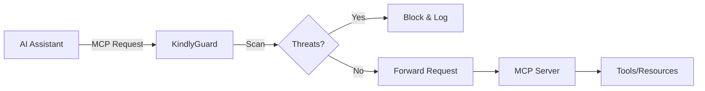

# 🛡️ KindlyGuard

> A security-focused MCP (Model Context Protocol) server that protects AI interactions from unicode attacks, injection attempts, and other threats.

[](https://www.rust-lang.org/)
[](https://github.com/samuel/kindly-guard)
[](LICENSE)

## Features

- **🔍 Unicode Threat Detection**: Protects against invisible characters, BiDi attacks, and homograph attempts
- **💉 Injection Prevention**: Blocks prompt injection, command injection, and path traversal
- **🚀 High Performance**: Lock-free scanning with SIMD optimizations
- **📊 Real-time Shield**: Visual security status with threat statistics
- **🔒 MCP-Specific Protection**: Prevents session ID exposure and tool poisoning
- **🎯 Zero Dependencies\***: Minimal external dependencies for reduced attack surface

\* *Core security features use only essential, audited dependencies*

## Quick Start

### Installation

```bash
# Clone the repository
git clone https://github.com/samuel/kindly-guard
cd kindly-guard

# Build with security profile
cargo build --profile=secure

# Install CLI tool
cargo install --path kindly-guard-cli
```

### Running the Server

```bash
# Start as MCP server (stdio mode)
kindly-guard

# Start with detailed logging
RUST_LOG=kindly_guard=debug kindly-guard

# Start with custom config
kindly-guard --config my-config.toml
```

### Using the CLI Scanner

```bash
# Scan a file for threats
kindly-guard scan suspicious.json

# Scan a directory recursively
kindly-guard scan ./untrusted-data/

# Monitor real-time with shield display
kindly-guard monitor
```

## Shield Display

When running, KindlyGuard shows a real-time security shield:

```
╭──────────────────────────────────────╮
│ 🛡️  KindlyGuard Security Shield      │
├──────────────────────────────────────┤
│ Status: ● Protected                  │
│ Uptime: 2h 15m 42s                  │
│                                      │
│ Threats Blocked                      │
│ ├─ Unicode Attacks:     23           │
│ ├─ Injection Attempts:  15           │
│ ├─ Path Traversal:      4            │
│ └─ Total:              42            │
│                                      │
│ Performance                          │
│ ├─ Scan Rate: 125k req/s            │
│ ├─ Avg Latency: 0.8ms               │
│ └─ Memory: 42 MB                    │
╰──────────────────────────────────────╯
```

## Configuration

Create a `kindly-guard.toml` file:

```toml
[server]
port = 8080
stdio = true
max_connections = 100

[scanner]
unicode_detection = true
injection_detection = true
path_traversal_detection = true
max_scan_depth = 10

[shield]
update_interval_ms = 1000
detailed_stats = false
color = true
```

## Threat Types Detected

### Unicode Threats
- **Invisible Characters**: Zero-width spaces, joiners, and other invisible Unicode
- **BiDi Attacks**: Right-to-left override characters that can reverse text
- **Homograph Attacks**: Lookalike characters from different scripts
- **Control Characters**: Dangerous control codes and format effectors

### Injection Threats
- **Prompt Injection**: Hidden instructions in user input
- **Command Injection**: Shell command attempts in parameters
- **Path Traversal**: Directory escape attempts (../, etc.)
- **SQL Injection**: Database manipulation attempts

### MCP-Specific Threats
- **Session ID Exposure**: Detects session IDs in URLs/logs
- **Tool Poisoning**: Malicious tool definitions
- **Token Theft**: OAuth token exposure risks

## Integration with AI Systems

KindlyGuard acts as a security middleware for MCP:



## Performance

- **Throughput**: 100k+ requests/second on modern hardware
- **Latency**: <1ms average scan time
- **Memory**: ~50MB base footprint
- **CPU**: Efficient SIMD-optimized scanning

## Security Guarantees

1. **No unsafe code** in public API
2. **No panics** in production paths
3. **Constant-time** security comparisons
4. **Memory safe** by Rust design
5. **Thread safe** with lock-free statistics

## Development

### Building from Source

```bash
# Debug build
cargo build

# Release with security checks
cargo build --profile=secure

# Run tests
cargo test --all-features

# Run benchmarks
cargo bench
```

### Security Audit

```bash
# Check dependencies
cargo audit

# Scan for unsafe code
cargo geiger

# Run clippy with all lints
cargo clippy -- -W clippy::all -W clippy::pedantic
```

## Contributing

We welcome contributions that improve security! Please:

1. Follow Rust security best practices
2. Add tests for any new threat detection
3. Document safety invariants for any unsafe code
4. Run security audit before submitting PR

See [CONTRIBUTING.md](CONTRIBUTING.md) for details.

## License

Licensed under either of:

- Apache License, Version 2.0 ([LICENSE-APACHE](LICENSE-APACHE))
- MIT license ([LICENSE-MIT](LICENSE-MIT))

at your option.

## Acknowledgments

- Built with [Rust](https://www.rust-lang.org/) for memory safety
- Uses [unicode-security](https://crates.io/crates/unicode-security) for Unicode threat detection
- Inspired by real-world MCP security incidents

---

**Remember**: Security is not a feature, it's a requirement.