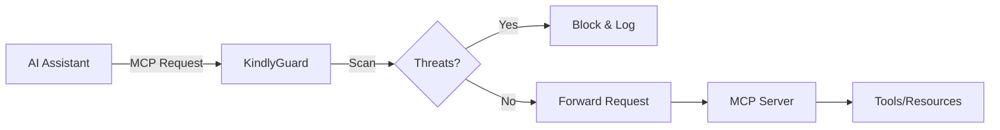

# 🛡️ KindlyGuard

<div align="center">

> A security-focused MCP (Model Context Protocol) server that protects AI interactions from unicode attacks, injection attempts, and other threats.

[](https://crates.io/crates/kindly-guard-server)
[](https://www.rust-lang.org/)
[](https://github.com/kindlyguard/kindly-guard/security)
[](LICENSE)
[](https://github.com/kindlyguard/kindly-guard/actions)
[](https://codecov.io/gh/kindlyguard/kindly-guard)

[Documentation](https://docs.kindlyguard.dev) | [Quick Start](#quick-start) | [API Reference](docs/API.md) | [Security Guide](docs/SECURITY_BEST_PRACTICES.md)

</div>

## Features

- **🔍 Unicode Threat Detection**: Protects against invisible characters, BiDi attacks, and homograph attempts
- **💉 Injection Prevention**: Blocks prompt injection, command injection, SQL injection, and path traversal
- **🚀 High Performance**: Lock-free scanning with optimized pattern matching
- **📊 Real-time Shield**: Visual security status with threat statistics (🟢 Green / 🔴 Red / ⚫ Gray)
- **🔒 Enterprise Security**: OAuth 2.0, Ed25519 signatures, fine-grained permissions, rate limiting
- **🎯 MCP Protocol Compliance**: Full JSON-RPC 2.0 implementation with standard tools and resources
- **⚡ Multiple Modes**: Standard mode for basic protection, Enhanced mode for advanced threat detection

## Quick Start

### Installation

#### From crates.io (Recommended)
```bash
# Install the server
cargo install kindly-guard-server

# Install the CLI tool
cargo install kindly-guard-cli
```

#### From source
```bash
# Clone the repository
git clone https://github.com/kindlyguard/kindly-guard
cd kindly-guard

# Build all components
cargo build --release

# Or install locally
cargo install --path kindly-guard-server
cargo install --path kindly-guard-cli
```

### Running the Server

```bash
# Start as MCP server (stdio mode - recommended)
kindly-guard --stdio

# Start with detailed logging
RUST_LOG=kindly_guard=debug kindly-guard --stdio

# Start with custom config
kindly-guard --config my-config.yaml --stdio

# Use systemd service (after installation)
sudo systemctl start kindly-guard
```

### Using the CLI Scanner

```bash
# Scan a file for threats
kindly-guard scan suspicious.json

# Scan a directory recursively
kindly-guard scan ./untrusted-data/

# Monitor real-time with shield display
kindly-guard monitor
```

## Shield Display

When running, KindlyGuard shows a real-time security shield:

```
╭──────────────────────────────────────╮
│ 🛡️  KindlyGuard Security Shield      │
├──────────────────────────────────────┤
│ Status: ● Protected                  │
│ Uptime: 2h 15m 42s                  │
│                                      │
│ Threats Blocked                      │
│ ├─ Unicode Attacks:     23           │
│ ├─ Injection Attempts:  15           │
│ ├─ Path Traversal:      4            │
│ └─ Total:              42            │
│                                      │
│ Performance                          │
│ ├─ Scan Rate: 125k req/s            │
│ ├─ Avg Latency: 0.8ms               │
│ └─ Memory: 42 MB                    │
╰──────────────────────────────────────╯
```

## Configuration

Create a `kindly-guard.yaml` file:

```yaml
# Scanner settings
scanner:
  unicode_detection: true
  injection_detection: true
  max_scan_depth: 10
  enable_event_buffer: false  # Set to true for optimized performance

# Authentication (recommended for production)
auth:
  enabled: true
  allowed_clients:
    - client_id: "my-app"
      secret: "change-me-in-production"
      allowed_scopes: ["tools:execute", "resources:read"]

# Rate limiting
rate_limit:
  enabled: true
  default_rpm: 60
  default_burst: 10

# Shield display
shield:
  display_enabled: true
  update_interval_ms: 1000
  show_timestamp: true
  show_stats: true
```

See [Configuration Guide](docs/CONFIGURATION.md) for all options.

## Threat Types Detected

### Unicode Threats
- **Invisible Characters**: Zero-width spaces, joiners, and other invisible Unicode
- **BiDi Attacks**: Right-to-left override characters that can reverse text
- **Homograph Attacks**: Lookalike characters from different scripts
- **Control Characters**: Dangerous control codes and format effectors

### Injection Threats
- **Prompt Injection**: Hidden instructions in user input
- **Command Injection**: Shell command attempts in parameters
- **Path Traversal**: Directory escape attempts (../, etc.)
- **SQL Injection**: Database manipulation attempts

### MCP-Specific Threats
- **Session ID Exposure**: Detects session IDs in URLs/logs
- **Tool Poisoning**: Malicious tool definitions
- **Token Theft**: OAuth token exposure risks

## Components

KindlyGuard consists of several crates:

- **[kindly-guard-server](https://crates.io/crates/kindly-guard-server)** - Main MCP server implementation
- **[kindly-guard-cli](https://crates.io/crates/kindly-guard-cli)** - Command-line tools for scanning and monitoring  
- **[kindly-guard-client](https://crates.io/crates/kindly-guard-client)** - Rust client library for integration

## Integration with AI Systems

KindlyGuard acts as a security middleware for MCP:



### Example Integration

```python
import subprocess
import json

# Start KindlyGuard
proc = subprocess.Popen(
    ["kindly-guard", "--stdio"],
    stdin=subprocess.PIPE,
    stdout=subprocess.PIPE,
    text=True
)

# Send scan request
request = {
    "jsonrpc": "2.0",
    "method": "tools/call",
    "params": {
        "name": "scan_text",
        "arguments": {
            "text": "Check this: '; DROP TABLE users; --"
        }
    },
    "id": 1
}
proc.stdin.write(json.dumps(request) + "\n")
proc.stdin.flush()

# Get response - will show SQL injection threat detected
response = json.loads(proc.stdout.readline())
```

## Performance

- **Throughput**: 100k+ requests/second on modern hardware
- **Latency**: <1ms average scan time
- **Memory**: ~50MB base footprint
- **CPU**: Efficient SIMD-optimized scanning

## Security Guarantees

1. **No unsafe code** in public API
2. **No panics** in production paths
3. **Constant-time** security comparisons
4. **Memory safe** by Rust design
5. **Thread safe** with lock-free statistics

## Development

### Building from Source

```bash
# Debug build
cargo build

# Release build
cargo build --release

# Run tests
cargo test

# Run benchmarks
cargo bench

# Run with enhanced features (requires private dependencies)
cargo build --features enhanced
```

### Security Audit

```bash
# Check dependencies
cargo audit

# Scan for unsafe code
cargo geiger

# Run clippy with all lints
cargo clippy -- -W clippy::all -W clippy::pedantic
```

## Contributing

We welcome contributions that improve security! Please:

1. Follow Rust security best practices
2. Add tests for any new threat detection
3. Document safety invariants for any unsafe code
4. Run security audit before submitting PR

See [CONTRIBUTING.md](CONTRIBUTING.md) for details.

## License

Licensed under either of:

- Apache License, Version 2.0 ([LICENSE-APACHE](LICENSE-APACHE))
- MIT license ([LICENSE-MIT](LICENSE-MIT))

at your option.

## Resources

- [API Documentation](docs/API.md) - Complete API reference
- [Configuration Guide](docs/CONFIGURATION.md) - Detailed configuration options
- [Security Best Practices](docs/SECURITY_BEST_PRACTICES.md) - Deployment and operational security
- [Tools & Resources](docs/TOOLS_AND_RESOURCES.md) - Available tools and resources

## Acknowledgments

- Built with [Rust](https://www.rust-lang.org/) for memory safety
- Implements [Model Context Protocol](https://modelcontextprotocol.io/) specification
- Uses [unicode-security](https://crates.io/crates/unicode-security) for Unicode threat detection
- Inspired by real-world AI security challenges

---

<div align="center">
<b>KindlyGuard</b> - Security for the AI era<br>
<i>Remember: Security is not a feature, it's a requirement.</i>
</div>