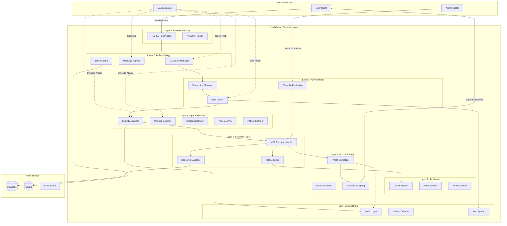
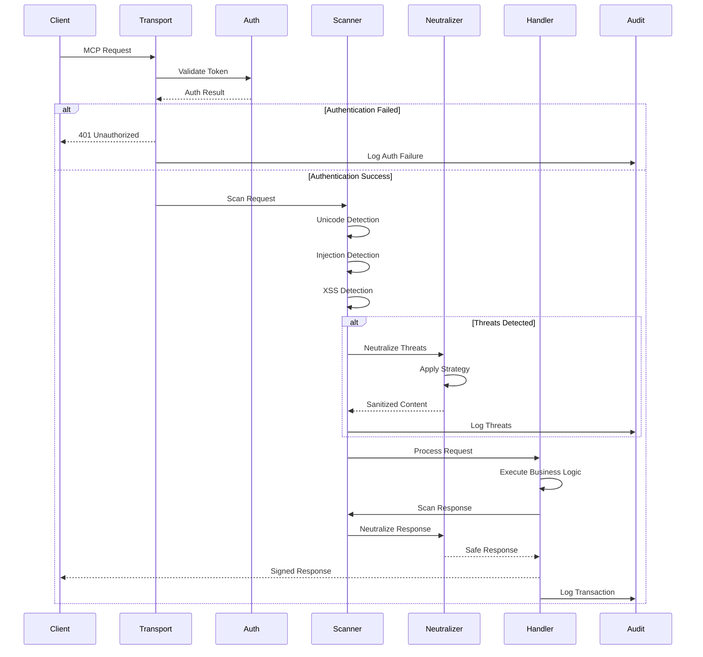
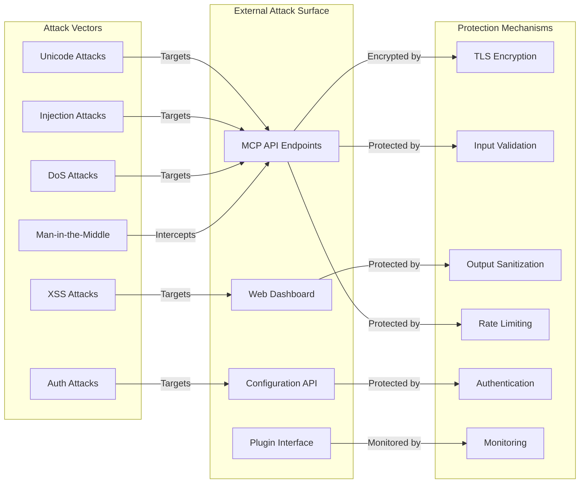
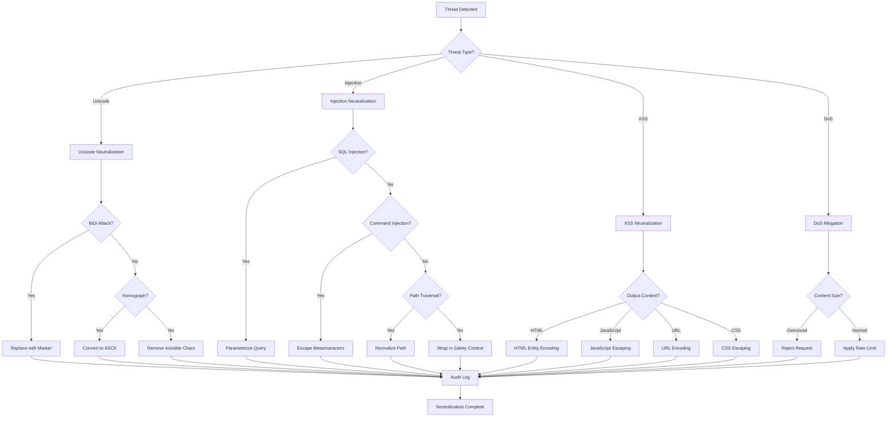
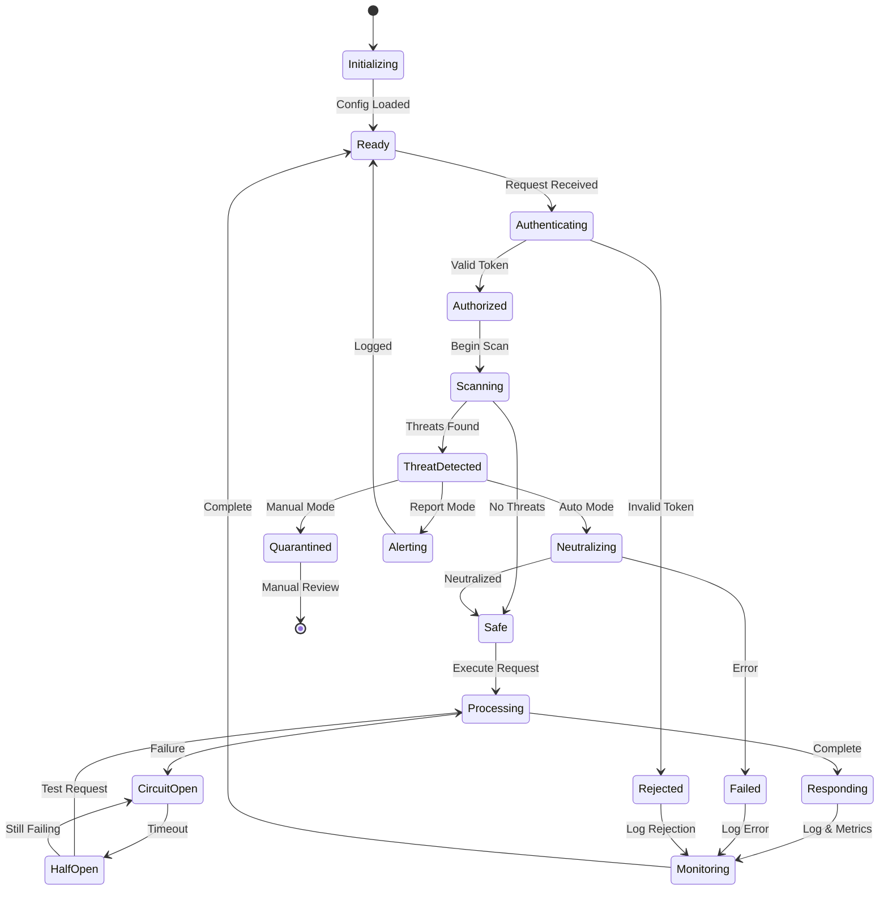
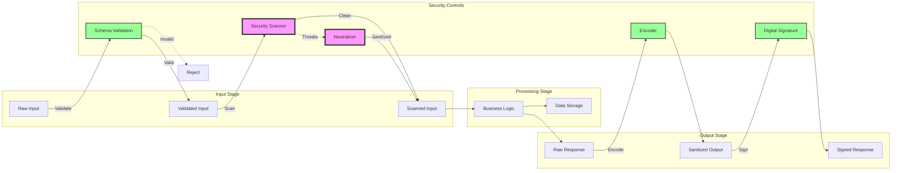
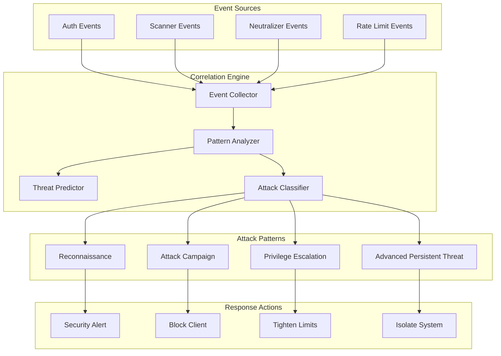
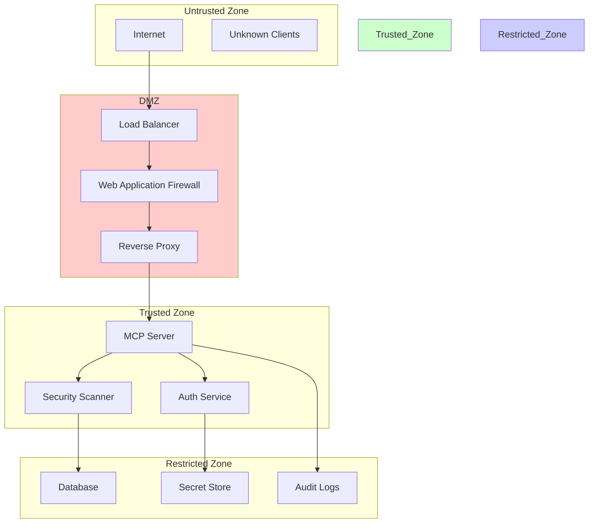
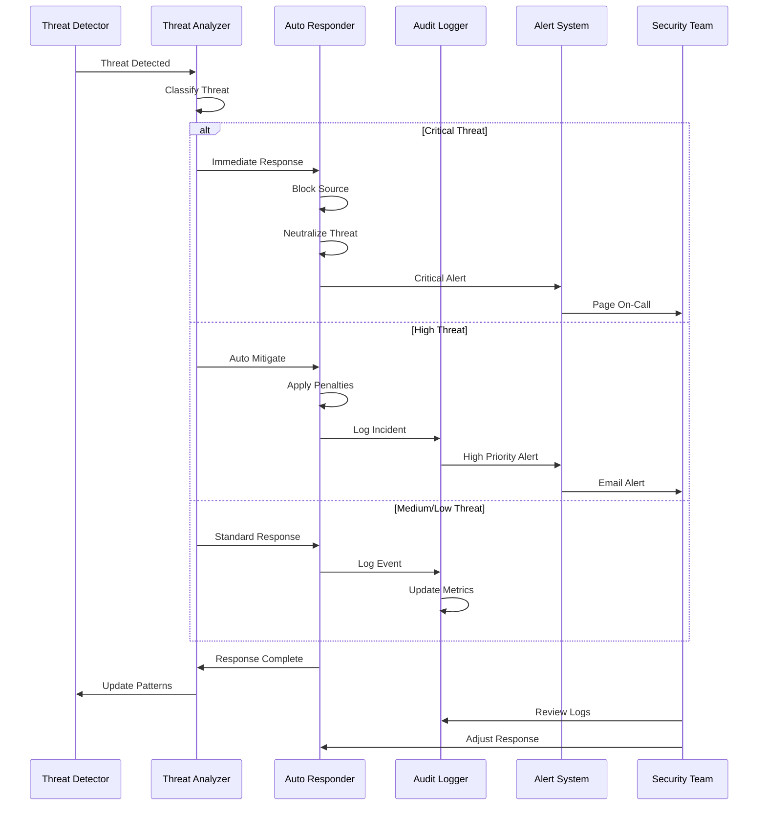

# KindlyGuard Threat Model Diagrams

## System Architecture Overview

## Threat Detection Flow

## Attack Surface Model

## Threat Neutralization Decision Tree

## Security State Machine

## Data Flow Security

## Threat Correlation Engine

## Security Zones

## Incident Response Flow

These diagrams provide a comprehensive visual representation of:

1. **System Architecture**: Shows all security layers and data flow
2. **Threat Detection Flow**: Details the request lifecycle with security checks
3. **Attack Surface Model**: Maps attack vectors to protection mechanisms
4. **Neutralization Decision Tree**: Shows how different threats are handled
5. **Security State Machine**: Represents system security states
6. **Data Flow Security**: Tracks security controls at each stage
7. **Threat Correlation Engine**: Shows how events are correlated
8. **Security Zones**: Illustrates network segmentation
9. **Incident Response Flow**: Details automated and manual response procedures

Each diagram highlights the defense-in-depth approach and shows how multiple security controls work together to protect the system.