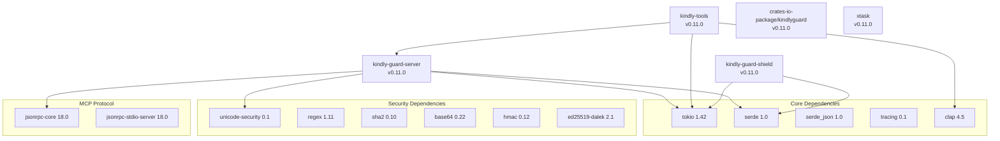
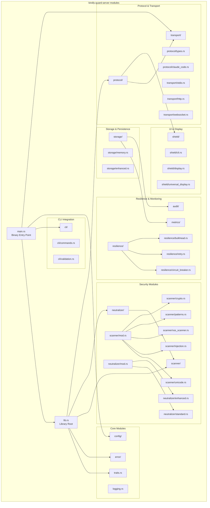
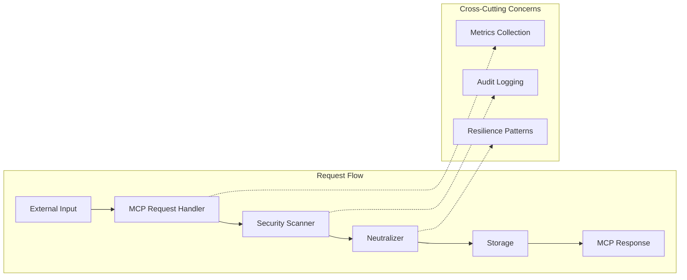
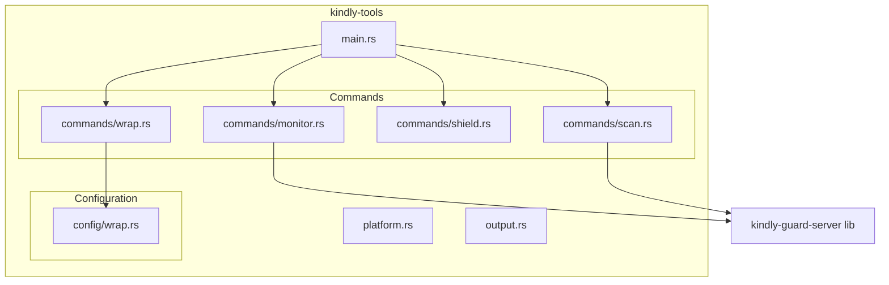
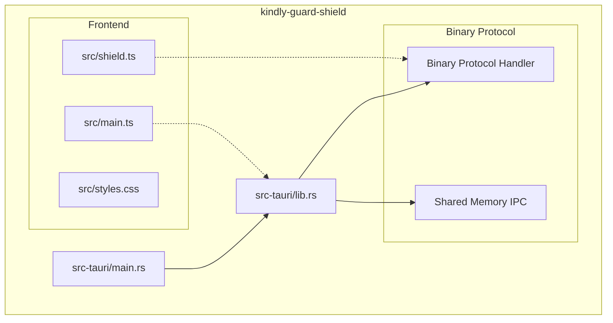
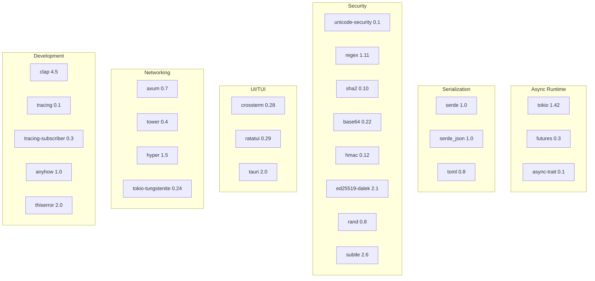
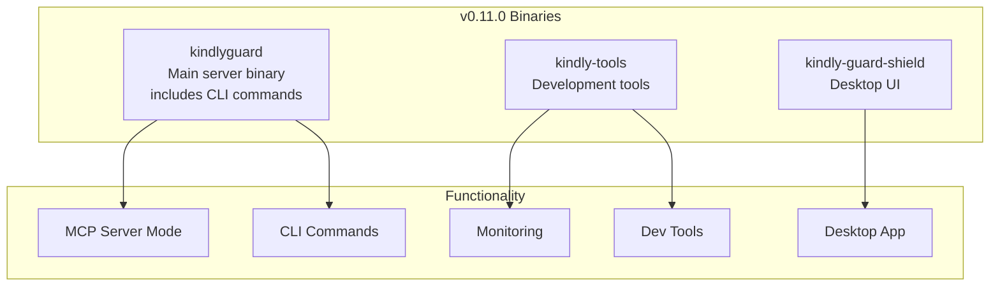

# KindlyGuard v0.11.0 Dependency Graph

Generated: 2025-07-06

## Overview

This document visualizes the dependency structure of KindlyGuard v0.11.0 after the binary consolidation that merged `kindly-guard-cli` into `kindly-guard-server`.

## High-Level Crate Dependencies

## Internal Module Structure - kindly-guard-server

## Detailed Module Interactions

## kindly-tools Dependencies

## kindly-guard-shield (Tauri App) Dependencies

## External Crate Dependencies Tree

## Binary Outputs After Consolidation

## Key Changes in v0.11.0

1. **Binary Consolidation**: `kindly-guard-cli` merged into `kindly-guard-server`, creating a single `kindlyguard` binary
2. **Module Reorganization**: CLI functionality moved to `cli/` module within server
3. **Simplified Distribution**: Fewer binaries to manage and distribute
4. **Shared Code**: Better code reuse between server and CLI functionality
5. **Enhanced Integration**: Direct access to server internals from CLI commands

## Module Importance Ranking

Based on the dependency analysis:

1. **Critical Path Modules**:
   - `scanner/` - Core security functionality
   - `protocol/` - MCP communication
   - `traits.rs` - Core trait definitions
   - `config/` - Configuration management

2. **High Priority Modules**:
   - `neutralizer/` - Threat mitigation
   - `transport/` - Communication layer
   - `resilience/` - Fault tolerance
   - `error/` - Error handling

3. **Support Modules**:
   - `shield/` - UI components
   - `storage/` - Persistence
   - `metrics/` - Monitoring
   - `audit/` - Logging

4. **Extension Modules**:
   - `cli/` - Command-line interface
   - `permissions/` - Access control
   - `plugins/` - Plugin system