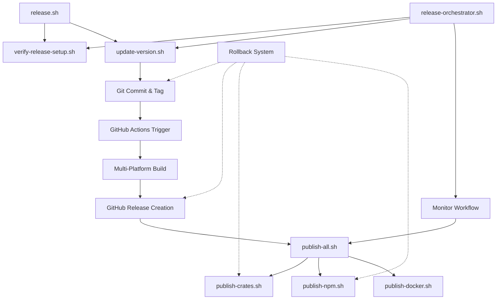

# KindlyGuard Automated Release Guide

## Table of Contents
1. [Overview](#overview)
2. [Quick Start](#quick-start)
3. [Architecture](#architecture)
4. [Components](#components)
5. [Common Scenarios](#common-scenarios)
6. [Best Practices](#best-practices)
7. [Troubleshooting](#troubleshooting)
8. [Advanced Usage](#advanced-usage)

## Overview

The KindlyGuard automated release system streamlines the entire release process from version updates to package publishing. It provides multiple levels of control while maintaining safety through validation and rollback capabilities.

### Key Features
- 🚀 One-command releases with `./scripts/release.sh`
- 🔄 Automatic version synchronization across all files
- 🏗️ Multi-platform builds via GitHub Actions
- 📦 Coordinated package publishing
- 🛡️ Built-in validation and safety checks
- ↩️ Automatic rollback on failures

## Quick Start

### Simple Release
```bash
# Standard release
./scripts/release.sh 0.9.6

# Preview what would happen
./scripts/release.sh 0.9.6 --dry-run

# Skip all prompts
./scripts/release.sh 0.9.6 --auto-publish
```

### Step-by-Step Release
```bash
# 1. Update version and create release tag
./scripts/update-version.sh --release 0.9.6

# 2. Monitor GitHub Actions build
# 3. Publish packages after build succeeds
./scripts/publish-all.sh
```

### Advanced Control
```bash
# Full orchestration with options
./scripts/release-orchestrator.sh \
  --version 0.9.6 \
  --branch main \
  --draft false \
  --auto-publish
```

## Architecture



### Component Interaction

1. **Entry Points**
   - `release.sh` - Simple interface for standard releases
   - `release-orchestrator.sh` - Full control with advanced options
   - Individual scripts - For manual step-by-step control

2. **Version Management**
   - `update-version.sh` - Updates all version references
   - `validate-versions.sh` - Ensures consistency
   - Git operations for commits and tags

3. **Build System**
   - GitHub Actions workflow triggered by tags
   - Builds for Linux, macOS, Windows
   - Creates release artifacts and checksums

4. **Publishing**
   - Waits for successful build
   - Publishes to multiple registries
   - Maintains order dependencies

## Components

### Core Scripts

#### release.sh
Simple wrapper for common release scenarios.

**Usage:**
```bash
./scripts/release.sh VERSION [OPTIONS]

OPTIONS:
    --dry-run       Preview changes
    --skip-checks   Skip verification
    --auto-publish  No prompts
```

**What it does:**
1. Verifies setup
2. Updates version
3. Creates release
4. Optionally publishes

#### update-version.sh
Comprehensive version updater with release capabilities.

**Usage:**
```bash
./scripts/update-version.sh VERSION [OPTIONS]

OPTIONS:
    --dry-run     Preview changes
    --no-commit   Don't commit
    --no-tag      Don't create tag
    --release     Full release mode
    --force       Override validation
```

**Features:**
- Updates all Cargo.toml files
- Updates package.json
- Updates Docker configurations
- Updates documentation
- Validates consistency

#### release-orchestrator.sh
Advanced orchestration for complex scenarios.

**Usage:**
```bash
./scripts/release-orchestrator.sh [OPTIONS]

OPTIONS:
    --version VERSION      Version to release
    --branch BRANCH        Source branch (default: current)
    --draft               Create draft release
    --prerelease          Mark as pre-release
    --auto-publish        Auto-publish packages
    --skip-tests          Skip test runs
    --dry-run            Preview mode
```

**Capabilities:**
- Full workflow control
- Progress monitoring
- Automatic retries
- Comprehensive logging

### Supporting Scripts

#### verify-release-setup.sh
Checks all prerequisites are met.

**Validates:**
- Tool availability (rust, npm, docker, gh)
- Authentication status
- Repository state
- Configuration files

#### validate-versions.sh
Ensures version consistency across files.

**Checks:**
- Cargo workspace members
- NPM package versions
- Docker image tags
- Documentation references

#### publish-all.sh
Coordinates package publishing.

**Publishes to:**
- crates.io (Rust packages)
- npm registry
- Docker Hub

**Features:**
- Order-aware publishing
- Retry on failures
- Validation before publish

## Common Scenarios

### Standard Release
Most common case for regular releases:

```bash
# 1. Simple one-command release
./scripts/release.sh 0.9.6

# 2. Follow prompts
# 3. Done!
```

### Pre-release (Beta/RC)
For testing releases:

```bash
# Beta release
./scripts/release-orchestrator.sh \
  --version 0.10.0-beta.1 \
  --prerelease

# Release candidate
./scripts/release-orchestrator.sh \
  --version 1.0.0-rc.1 \
  --prerelease
```

### Hotfix Release
For urgent patches:

```bash
# 1. Create hotfix branch
git checkout -b hotfix/0.9.6.1 v0.9.6

# 2. Apply fixes
# ... make changes ...

# 3. Release
./scripts/release.sh 0.9.6.1 --skip-checks
```

### Draft Release
For preparing releases without publishing:

```bash
# Create draft
./scripts/release-orchestrator.sh \
  --version 1.0.0 \
  --draft

# Later, publish when ready
gh release edit v1.0.0 --draft=false
```

### Multi-stage Release
For careful, staged rollouts:

```bash
# 1. Update version without release
./scripts/update-version.sh 1.0.0 --no-tag

# 2. Review changes
git diff

# 3. Complete release when ready
git tag -a v1.0.0 -m "Release 1.0.0"
git push origin v1.0.0
```

## Best Practices

### 1. Pre-release Checklist
Always ensure before releasing:
- ✅ All tests pass locally
- ✅ CHANGELOG.md is updated
- ✅ No uncommitted changes
- ✅ On correct branch
- ✅ MSRV compatibility verified (`cargo +1.80 test --all-features`)
- ✅ rust-toolchain.toml matches workspace MSRV

### 2. Version Numbering
Follow semantic versioning:
- **Major** (1.0.0): Breaking changes
- **Minor** (0.9.0): New features
- **Patch** (0.9.6): Bug fixes

### 3. Release Notes
Good release notes include:
- Summary of changes
- Breaking changes (if any)
- Migration instructions
- Acknowledgments

### 4. Testing Releases
Before major releases:
```bash
# 1. Create pre-release
./scripts/release.sh 1.0.0-rc.1 --prerelease

# 2. Test thoroughly
# 3. Gather feedback
# 4. Final release
./scripts/release.sh 1.0.0
```

### 5. Communication
After release:
- Update project website
- Post announcement
- Notify users
- Monitor feedback

## Troubleshooting

### Common Issues

#### Version Already Exists
**Error:** "Tag v0.9.6 already exists"

**Solution:**
```bash
# Delete local tag
git tag -d v0.9.6

# Delete remote tag (careful!)
git push --delete origin v0.9.6

# Retry release
./scripts/release.sh 0.9.6
```

#### Authentication Failures
**Error:** "Authentication required"

**Solution:**
```bash
# GitHub
gh auth login

# NPM
npm login

# Crates.io
cargo login

# Docker
docker login
```

#### Build Failures
**Error:** "GitHub Actions workflow failed"

**Solution:**
1. Check [Actions tab](https://github.com/kindlysoftware/kindlyguard/actions)
2. Review error logs
3. Fix issues and retry:
   ```bash
   # Retrigger workflow
   gh workflow run release.yml -f version=v0.9.6
   ```

#### Partial Release
**Error:** "Some packages failed to publish"

**Solution:**
```bash
# Check what was published
cargo search kindly-guard
npm view @kindlyguard/kindlyguard

# Retry failed components
./scripts/publish-npm.sh  # If npm failed
./scripts/publish-docker.sh  # If docker failed
```

### Emergency Procedures

#### Abort In-Progress Release
```bash
# Stop everything
./scripts/abort-release.sh

# This will:
# - Cancel GitHub workflows
# - Clean up partial uploads
# - Reset local state
```

#### Rollback Released Version
```bash
# Quick rollback
./scripts/rollback-release.sh v0.9.6

# Manual rollback
gh release edit v0.9.6 --prerelease
cargo yank --version 0.9.6 kindly-guard-server
npm deprecate @kindlyguard/kindlyguard@0.9.6 "Use 0.9.7"
```

#### Clean Failed State
```bash
# Reset to clean state
./scripts/cleanup-failed-release.sh v0.9.6

# Manually reset
git reset --hard HEAD~1
git tag -d v0.9.6
git push --delete origin v0.9.6
```

### Debug Mode

Enable detailed logging:
```bash
# Debug release script
DEBUG=1 ./scripts/release.sh 0.9.6

# Debug with orchestrator
./scripts/release-orchestrator.sh \
  --version 0.9.6 \
  --log-level debug

# Check logs
tail -f ./logs/release-*.log
```

## Advanced Usage

### Custom Workflows

#### Skip Certain Steps
```bash
# Update version only
./scripts/update-version.sh 0.9.6 --no-tag

# Create tag manually later
git tag -a v0.9.6 -m "Custom message"
git push origin v0.9.6
```

#### Parallel Publishing
```bash
# Publish packages in parallel
(./scripts/publish-crates.sh &)
(./scripts/publish-npm.sh &)
(./scripts/publish-docker.sh &)
wait
```

#### Custom Release Notes
```bash
# 1. Create release with custom notes
./scripts/release-orchestrator.sh \
  --version 0.9.6 \
  --release-notes-file CUSTOM_NOTES.md
```

### Integration with CI/CD

#### GitLab CI Example
```yaml
release:
  script:
    - ./scripts/release.sh $CI_COMMIT_TAG --auto-publish
  only:
    - tags
```

#### Jenkins Example
```groovy
pipeline {
  stages {
    stage('Release') {
      when { tag pattern: "v\\d+\\.\\d+\\.\\d+", comparator: "REGEXP" }
      steps {
        sh './scripts/release.sh ${TAG_NAME#v} --auto-publish'
      }
    }
  }
}
```

### Monitoring and Metrics

Track release metrics:
```bash
# Release success rate
grep "Release completed" ./logs/release-*.log | wc -l

# Average release time
grep "Total time:" ./logs/release-*.log | awk '{sum+=$3} END {print sum/NR}'

# Failed releases
grep "ERROR" ./logs/release-*.log | sort | uniq -c
```

### Extending the System

Add custom validation:
```bash
# Create custom pre-release hook
cat > ./scripts/hooks/pre-release.sh << 'EOF'
#!/bin/bash
# Custom validation logic
echo "Running custom checks..."
# Add your checks here
EOF

chmod +x ./scripts/hooks/pre-release.sh
```

## Security Considerations

### Secure Token Storage
Never commit tokens. Use:
```bash
# GitHub CLI for GitHub token
gh auth login

# Environment variables for others
export CARGO_REGISTRY_TOKEN="..."
export NPM_TOKEN="..."
```

### Signed Releases
Enable GPG signing:
```bash
# Configure Git
git config --global user.signingkey YOUR_KEY_ID
git config --global commit.gpgsign true
git config --global tag.gpgsign true

# Release will be signed automatically
./scripts/release.sh 0.9.6
```

### Audit Trail
All releases are logged:
- Git commits and tags
- GitHub release history
- Package registry versions
- Local logs in `./logs/`

## Appendix

### Environment Variables

| Variable | Description | Default |
|----------|-------------|---------|
| `GITHUB_TOKEN` | GitHub authentication | From `gh` CLI |
| `CARGO_REGISTRY_TOKEN` | Crates.io token | From `cargo login` |
| `NPM_TOKEN` | NPM auth token | From `npm login` |
| `DOCKER_TOKEN` | Docker Hub token | From `docker login` |
| `DEBUG` | Enable debug output | `0` |
| `RELEASE_BRANCH` | Default branch | Current branch |
| `RELEASE_TIMEOUT` | Workflow timeout | `3600` (1 hour) |

### File Locations

| File | Purpose |
|------|---------|
| `./scripts/release.sh` | Main release script |
| `./scripts/release-orchestrator.sh` | Advanced orchestration |
| `./scripts/update-version.sh` | Version updater |
| `./scripts/validate-versions.sh` | Version validator |
| `./scripts/verify-release-setup.sh` | Setup checker |
| `./scripts/publish-*.sh` | Package publishers |
| `./logs/release-*.log` | Release logs |
| `./.github/workflows/release.yml` | GitHub Actions workflow |

### Related Documentation

- [RELEASING.md](../RELEASING.md) - Release process overview
- [RELEASE_CHECKLIST.md](../RELEASE_CHECKLIST.md) - Manual checklist
- [SECURITY.md](../SECURITY.md) - Security policies
- [CONTRIBUTING.md](../CONTRIBUTING.md) - Contribution guidelines

---

*Last updated: January 2025*