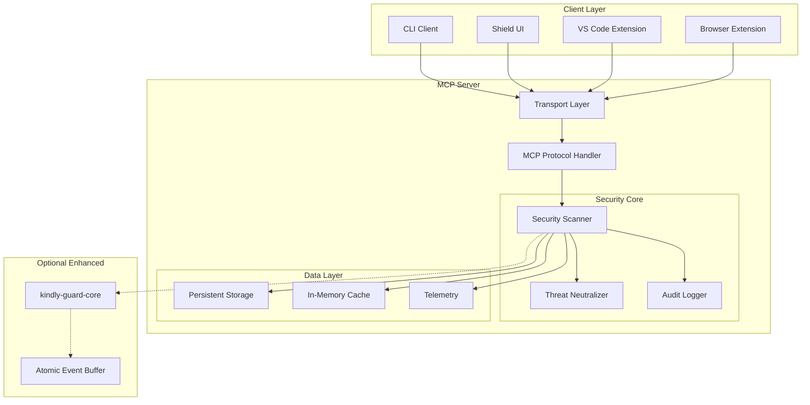
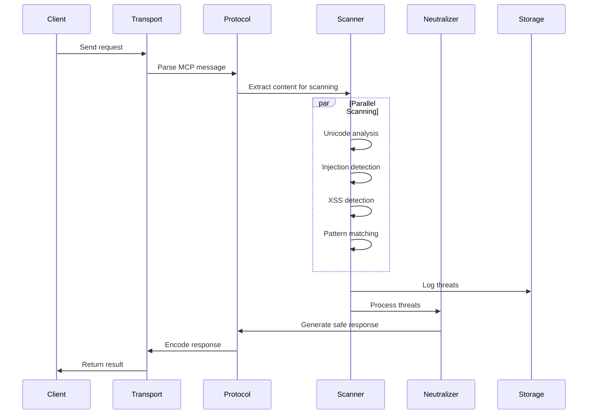
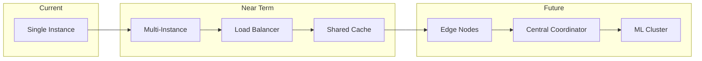

# KindlyGuard Architecture Documentation

## System Overview

KindlyGuard is a security-focused Model Context Protocol (MCP) server that provides real-time threat detection and neutralization for AI assistants. Built with Rust for performance and safety, it implements a multi-layered security architecture.



## Core Components

### 1. Transport Layer (`src/transport/`)
- **Purpose**: Handle client connections and protocol negotiation
- **Key Files**:
  - `stdio.rs` - Standard I/O transport for CLI integration
  - `websocket.rs` - WebSocket transport for web clients
  - `ipc.rs` - Inter-process communication for desktop apps

### 2. MCP Protocol Handler (`src/protocol/`)
- **Purpose**: Implement Model Context Protocol specification
- **Key Components**:
  - `handler.rs` - Main request/response handler
  - `types.rs` - Protocol type definitions
  - `traits.rs` - Core trait definitions

### 3. Security Scanner (`src/scanner/`)
The heart of KindlyGuard's threat detection:

```rust
// CLAUDE-note-architecture: Scanner module structure
scanner/
├── mod.rs          // Scanner trait and factory
├── unicode.rs      // Unicode security threats
├── injection.rs    // SQL/Command injection
├── xss.rs          // Cross-site scripting
├── patterns.rs     // Malicious pattern detection
└── enhanced.rs     // Optional enhanced scanner
```

#### Scanning Pipeline:
1. **Input Normalization** - Unicode normalization, encoding detection
2. **Threat Detection** - Parallel scanning for multiple threat types
3. **Risk Assessment** - Severity scoring and threat categorization
4. **Response Generation** - Neutralization recommendations

### 4. Threat Neutralizer (`src/neutralizer/`)
- **Purpose**: Transform dangerous input into safe alternatives
- **Strategies**:
  - Encoding (HTML entities, URL encoding)
  - Sanitization (Remove dangerous patterns)
  - Transformation (Safe alternatives)
  - Blocking (Reject entirely)

### 5. Audit System (`src/audit/`)
- **Purpose**: Comprehensive security event logging
- **Features**:
  - Tamper-proof event logs
  - Compliance reporting (SOC2, GDPR)
  - Real-time alerting
  - Forensic analysis support

### 6. Storage Layer (`src/storage/`)
- **SQLite Backend**: Persistent threat database
- **Schema**:
  ```sql
  -- CLAUDE-note-implemented: Database schema
  CREATE TABLE threats (
      id TEXT PRIMARY KEY,
      timestamp INTEGER NOT NULL,
      threat_type TEXT NOT NULL,
      severity INTEGER NOT NULL,
      input_hash TEXT NOT NULL,
      details JSONB
  );
  
  CREATE TABLE audit_log (
      id INTEGER PRIMARY KEY,
      timestamp INTEGER NOT NULL,
      event_type TEXT NOT NULL,
      user_id TEXT,
      details JSONB
  );
  ```

### 7. Resilience Layer (`src/resilience/`)
Fault tolerance and reliability patterns:

```rust
// CLAUDE-note-pattern: Circuit breaker implementation
pub struct CircuitBreaker<T> {
    failure_threshold: u32,
    recovery_timeout: Duration,
    state: Arc<RwLock<CircuitState>>,
}

// CLAUDE-note-pattern: Retry with exponential backoff
pub struct RetryPolicy {
    max_attempts: u32,
    initial_delay: Duration,
    max_delay: Duration,
    multiplier: f64,
}
```

## Data Flow

### Request Processing Flow:


### State Management:
- **Stateless scanning**: Each request is independent
- **Cached results**: LRU cache for repeated queries
- **Session tracking**: Optional client session management
- **Metrics aggregation**: Real-time performance tracking

## Security Architecture

### Defense in Depth:
1. **Input Validation** - Type checking, size limits, encoding validation
2. **Threat Detection** - Multi-engine scanning with ML models
3. **Neutralization** - Context-aware sanitization
4. **Output Encoding** - Proper escaping for target context
5. **Audit Trail** - Complete security event logging

### Threat Model:
```yaml
# CLAUDE-note-security: Threat categories
threats:
  - category: Unicode Attacks
    severity: HIGH
    examples:
      - Homograph attacks
      - Bidi override attacks
      - Zero-width characters
    
  - category: Injection Attacks
    severity: CRITICAL
    examples:
      - SQL injection
      - Command injection
      - LDAP injection
      
  - category: XSS Attacks
    severity: HIGH
    examples:
      - Reflected XSS
      - Stored XSS
      - DOM-based XSS
      
  - category: Prompt Injection
    severity: HIGH
    examples:
      - Instruction override
      - Context manipulation
      - Jailbreak attempts
```

## Performance Characteristics

### Benchmarks:
```yaml
# CLAUDE-note-performance: Measured on Apple M2
operations:
  unicode_scan:
    throughput: "1.2M chars/sec"
    latency_p50: "82µs"
    latency_p99: "145µs"
    
  full_scan:
    throughput: "850K chars/sec"
    latency_p50: "118µs"
    latency_p99: "312µs"
    
  cache_hit:
    latency: "<1µs"
    hit_rate: "~85%"
```

### Resource Usage:
- **Memory**: ~50MB base + 0.1MB per connection
- **CPU**: Single-threaded scanner, async I/O
- **Disk**: Minimal (SQLite WAL mode)
- **Network**: Protocol overhead <5%

## Deployment Architecture

### Container Deployment:
```dockerfile
# CLAUDE-note-deployment: Production Dockerfile
FROM rust:1.75-alpine AS builder
# Multi-stage build for minimal image

FROM alpine:3.19
# Runtime with security hardening
USER kindly:kindly
EXPOSE 8080
```

### Scaling Strategy:
1. **Vertical**: Single instance handles ~10K concurrent connections
2. **Horizontal**: Stateless design enables easy scaling
3. **Edge deployment**: Can run at edge locations
4. **Embedded**: Can be embedded in other applications

## Integration Points

### MCP Clients:
- **Claude Desktop**: Native stdio integration
- **VS Code**: Extension with Language Server Protocol
- **Web Apps**: WebSocket connectivity
- **CLI Tools**: Direct stdio communication

### External Systems:
```yaml
# CLAUDE-note-integrations: External system hooks
integrations:
  - name: SIEM
    protocol: Syslog
    events: [threat_detected, scan_failed]
    
  - name: Metrics
    protocol: OpenTelemetry
    metrics: [scan_duration, threat_count, cache_hit_rate]
    
  - name: Alerting
    protocol: Webhook
    events: [critical_threat, system_error]
```

## Configuration Management

### Configuration Hierarchy:
1. **Default config** - Built-in safe defaults
2. **File config** - TOML/JSON/YAML files
3. **Environment** - Environment variable overrides
4. **Runtime** - Dynamic reconfiguration via API

### Key Configuration Areas:
```toml
# CLAUDE-note-config: Example configuration
[scanner]
timeout_ms = 1000
max_input_size = 1048576  # 1MB
parallel_scanners = 4

[security]
unicode_security_level = "strict"
injection_detection = true
xss_detection = true

[transport]
listen_address = "127.0.0.1:8080"
max_connections = 1000

[storage]
path = "./kindly.db"
wal_mode = true
cache_size_mb = 100
```

## Error Handling Strategy

### Error Categories:
1. **Configuration Errors** - Fail fast on startup
2. **Runtime Errors** - Graceful degradation
3. **Security Errors** - Log and alert
4. **Protocol Errors** - Return proper MCP errors

### Error Response Format:
```rust
// CLAUDE-note-pattern: Consistent error responses
#[derive(Serialize)]
pub struct ErrorResponse {
    pub code: ErrorCode,
    pub message: String,
    pub details: Option<Value>,
    pub request_id: Uuid,
}
```

## Monitoring and Observability

### Metrics:
- Request rate and latency
- Threat detection rates by type
- Cache performance
- Resource utilization

### Logging:
- Structured JSON logs
- Log levels: ERROR, WARN, INFO, DEBUG, TRACE
- Correlation IDs for request tracing

### Health Checks:
```rust
// CLAUDE-note-endpoint: Health check endpoints
GET /health/live    -> 200 OK (am I alive?)
GET /health/ready   -> 200 OK (am I ready to serve?)
GET /metrics        -> Prometheus format metrics
```

## Future Architecture Considerations

### Planned Enhancements:
1. **ML-based threat detection** - TensorFlow Lite integration
2. **Distributed caching** - Redis/Valkey support
3. **Multi-region deployment** - Edge computing support
4. **Plugin system** - Custom scanner plugins
5. **GraphQL API** - Alternative to MCP for some use cases

### Scalability Path:


## Development Workflow

### Build Pipeline:
1. **Local development** - `cargo watch -x run`
2. **Testing** - Unit, integration, and property tests
3. **Benchmarking** - Criterion.rs benchmarks
4. **Security audit** - `cargo audit` and fuzzing
5. **Release** - Multi-platform builds via GitHub Actions