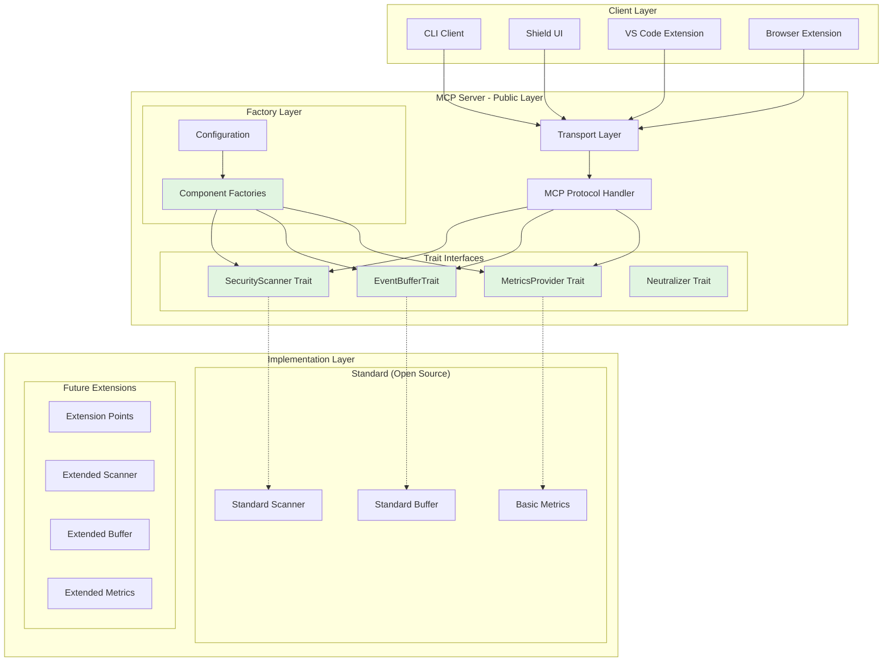
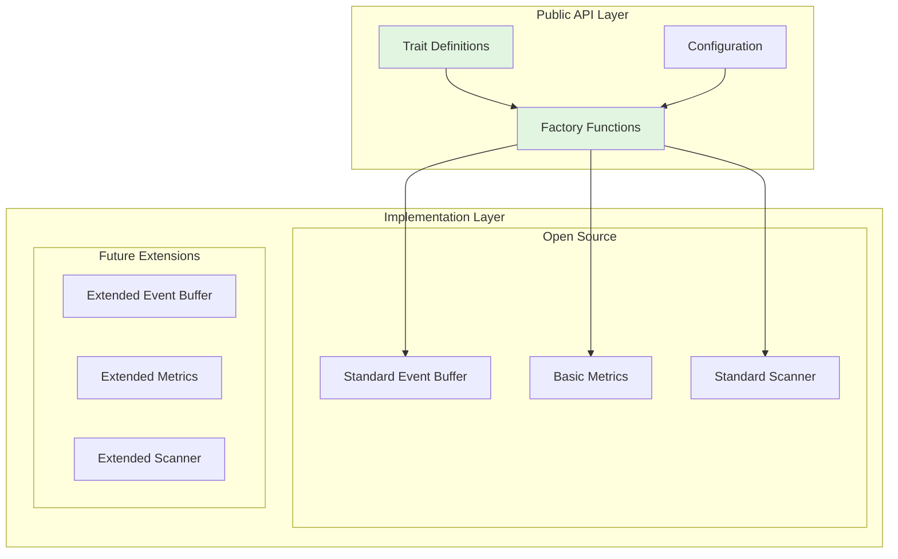
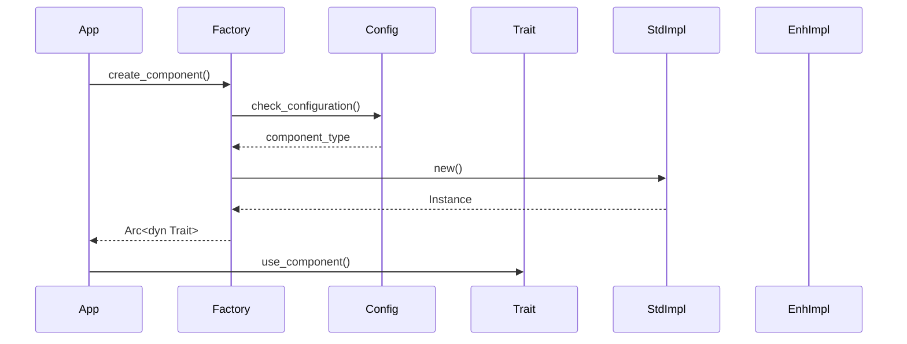
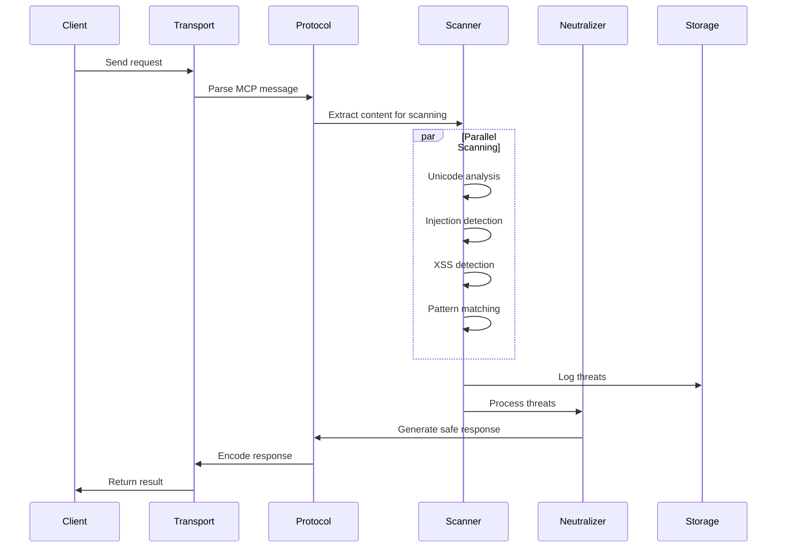
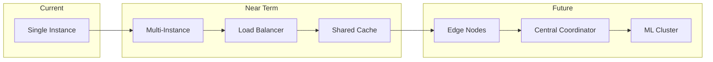

# KindlyGuard Architecture Documentation

## System Overview

KindlyGuard is a security-focused Model Context Protocol (MCP) server that provides real-time threat detection and neutralization for AI assistants. Built with Rust for performance and safety, it implements a multi-layered security architecture.



## Trait-Based Component Architecture

### Overview

KindlyGuard employs a sophisticated trait-based architecture that cleanly separates public interfaces from implementations. This design enables modular and extensible development while maintaining a single, consistent API surface.

### Key Design Principles

1. **Interface Segregation**: All major components are defined as traits, ensuring clean contracts
2. **Implementation Flexibility**: Multiple implementations can exist for any trait
3. **Runtime Selection**: Factory functions choose implementations based on configuration
4. **Dependency Inversion**: High-level modules depend on abstractions, not concrete types

### Architecture Diagram



### Core Traits

#### EventBufferTrait
```rust
// Public trait definition in kindly-guard
pub trait EventBufferTrait: Send + Sync {
    fn push(&self, event: SecurityEvent) -> Result<()>;
    fn pop(&self) -> Option<SecurityEvent>;
    fn flush(&self) -> Vec<SecurityEvent>;
    fn len(&self) -> usize;
}
```

#### MetricsProvider
```rust
pub trait MetricsProvider: Send + Sync {
    fn record_event(&self, event_type: &str, value: f64);
    fn get_histogram(&self, name: &str) -> Option<Histogram>;
    fn export_metrics(&self) -> MetricsSnapshot;
}
```

#### SecurityScanner
```rust
pub trait SecurityScanner: Send + Sync {
    async fn scan(&self, input: &str) -> ScanResult;
    fn capabilities(&self) -> ScannerCapabilities;
    fn update_rules(&mut self, rules: RuleSet) -> Result<()>;
}
```

### Factory Pattern Implementation

Factory functions provide the bridge between trait definitions and concrete implementations:

```rust
// Factory function that creates implementation
pub fn create_event_buffer(config: &Config) -> Arc<dyn EventBufferTrait> {
    // Create standard implementation
    Arc::new(StandardEventBuffer::new(config))
}
```

### Configuration-Based Selection

The system uses a hierarchical configuration approach:

```toml
# Configuration example
[components]
# Component configuration
buffer_type = "standard"
scanner_type = "standard"
metrics_type = "standard"
```

### Implementation Examples

#### Standard Implementation (Open Source)
```rust
// Standard implementation in main crate
pub struct StandardEventBuffer {
    events: Mutex<VecDeque<SecurityEvent>>,
    capacity: usize,
}

impl EventBufferTrait for StandardEventBuffer {
    fn push(&self, event: SecurityEvent) -> Result<()> {
        let mut events = self.events.lock().unwrap();
        if events.len() >= self.capacity {
            events.pop_front();
        }
        events.push_back(event);
        Ok(())
    }
    // ... other methods
}
```


### Benefits of This Architecture

#### 1. Clean Separation of Concerns
- Public APIs remain stable and well-documented
- Implementation details are hidden behind trait boundaries
- Changes to implementations don't affect the public interface

#### 2. Flexibility for Users
- Users can extend with custom implementations
- Configuration-driven feature selection
- Clean plugin architecture

#### 3. Maintainability and Testing
- Each implementation can be tested independently
- Mock implementations simplify unit testing
- Clear boundaries reduce coupling between components

#### 4. Performance Optimization
- Implementations can use advanced techniques
- Zero-cost abstractions through Rust's trait system
- Runtime overhead minimized through static dispatch where possible

### Component Lifecycle



### Best Practices

1. **Always define traits first** - Design the interface before implementation
2. **Use Arc<dyn Trait>** - Enables runtime polymorphism and sharing
3. **Provide sensible defaults** - Standard implementations should be fully functional
4. **Document trait contracts** - Clear documentation of expected behavior
5. **Version traits carefully** - Breaking changes require major version bumps

## Core Components

### 1. Transport Layer (`src/transport/`)
- **Purpose**: Handle client connections and protocol negotiation
- **Key Files**:
  - `stdio.rs` - Standard I/O transport for CLI integration
  - `websocket.rs` - WebSocket transport for web clients
  - `ipc.rs` - Inter-process communication for desktop apps

### 2. MCP Protocol Handler (`src/protocol/`)
- **Purpose**: Implement Model Context Protocol specification
- **Key Components**:
  - `handler.rs` - Main request/response handler
  - `types.rs` - Protocol type definitions
  - `traits.rs` - Core trait definitions

### 3. Security Scanner (`src/scanner/`)
The heart of KindlyGuard's threat detection, implemented using trait-based architecture:

```rust
// CLAUDE-note-architecture: Scanner module structure
scanner/
├── mod.rs          // SecurityScanner trait definition
├── factory.rs      // Scanner factory functions
├── standard/       // Open-source implementations
│   ├── mod.rs      // Standard scanner implementation
│   ├── unicode.rs  // Basic Unicode security
│   ├── injection.rs// Standard SQL/Command injection
│   └── xss.rs      // Basic XSS detection
└── traits.rs       // Scanner-specific sub-traits
```

#### SecurityScanner Trait
```rust
pub trait SecurityScanner: Send + Sync {
    async fn scan(&self, input: &str) -> ScanResult;
    fn capabilities(&self) -> ScannerCapabilities;
    fn update_rules(&mut self, rules: RuleSet) -> Result<()>;
}

// Factory function for scanner creation
pub fn create_scanner(config: &Config) -> Arc<dyn SecurityScanner> {
    Arc::new(StandardScanner::new(config))
}
```

#### Scanning Pipeline:
1. **Input Normalization** - Unicode normalization, encoding detection
2. **Threat Detection** - Parallel scanning for multiple threat types
3. **Risk Assessment** - Severity scoring and threat categorization
4. **Response Generation** - Neutralization recommendations

### 4. Threat Neutralizer (`src/neutralizer/`)
- **Purpose**: Transform dangerous input into safe alternatives
- **Strategies**:
  - Encoding (HTML entities, URL encoding)
  - Sanitization (Remove dangerous patterns)
  - Transformation (Safe alternatives)
  - Blocking (Reject entirely)

### 5. Audit System (`src/audit/`)
- **Purpose**: Comprehensive security event logging
- **Features**:
  - Tamper-proof event logs
  - Compliance reporting (SOC2, GDPR)
  - Real-time alerting
  - Forensic analysis support

### 6. Storage Layer (`src/storage/`)
- **SQLite Backend**: Persistent threat database
- **Schema**:
  ```sql
  -- CLAUDE-note-implemented: Database schema
  CREATE TABLE threats (
      id TEXT PRIMARY KEY,
      timestamp INTEGER NOT NULL,
      threat_type TEXT NOT NULL,
      severity INTEGER NOT NULL,
      input_hash TEXT NOT NULL,
      details JSONB
  );
  
  CREATE TABLE audit_log (
      id INTEGER PRIMARY KEY,
      timestamp INTEGER NOT NULL,
      event_type TEXT NOT NULL,
      user_id TEXT,
      details JSONB
  );
  ```

### 7. Resilience Layer (`src/resilience/`)
Fault tolerance and reliability patterns using trait-based design:

```rust
// CLAUDE-note-pattern: Resilience traits
pub trait CircuitBreakerTrait {
    fn call<F, T>(&self, f: F) -> Result<T>
    where
        F: FnOnce() -> Result<T>;
    
    fn state(&self) -> CircuitState;
    fn reset(&self);
}

pub trait RetryPolicyTrait {
    async fn execute<F, T>(&self, f: F) -> Result<T>
    where
        F: Fn() -> Future<Output = Result<T>> + Send;
}

// Factory functions for resilience components
pub fn create_circuit_breaker(config: &Config) -> Arc<dyn CircuitBreakerTrait> {
    Arc::new(StandardCircuitBreaker::new(config))
}
```

## Data Flow

### Request Processing Flow:


### State Management:
- **Stateless scanning**: Each request is independent
- **Cached results**: LRU cache for repeated queries
- **Session tracking**: Optional client session management
- **Metrics aggregation**: Real-time performance tracking

## Security Architecture

### Defense in Depth:
1. **Input Validation** - Type checking, size limits, encoding validation
2. **Threat Detection** - Multi-engine scanning with ML models
3. **Neutralization** - Context-aware sanitization
4. **Output Encoding** - Proper escaping for target context
5. **Audit Trail** - Complete security event logging

### Threat Model:
```yaml
# CLAUDE-note-security: Threat categories
threats:
  - category: Unicode Attacks
    severity: HIGH
    examples:
      - Homograph attacks
      - Bidi override attacks
      - Zero-width characters
    
  - category: Injection Attacks
    severity: CRITICAL
    examples:
      - SQL injection
      - Command injection
      - LDAP injection
      
  - category: XSS Attacks
    severity: HIGH
    examples:
      - Reflected XSS
      - Stored XSS
      - DOM-based XSS
      
  - category: Prompt Injection
    severity: HIGH
    examples:
      - Instruction override
      - Context manipulation
      - Jailbreak attempts
```

## Performance Characteristics

### Benchmarks:
```yaml
# CLAUDE-note-performance: Measured on Apple M2
operations:
  unicode_scan:
    throughput: "1.2M chars/sec"
    latency_p50: "82µs"
    latency_p99: "145µs"
    
  full_scan:
    throughput: "850K chars/sec"
    latency_p50: "118µs"
    latency_p99: "312µs"
    
  cache_hit:
    latency: "<1µs"
    hit_rate: "~85%"
```

### Resource Usage:
- **Memory**: ~50MB base + 0.1MB per connection
- **CPU**: Single-threaded scanner, async I/O
- **Disk**: Minimal (SQLite WAL mode)
- **Network**: Protocol overhead <5%

## Deployment Architecture

### Container Deployment:
```dockerfile
# CLAUDE-note-deployment: Production Dockerfile
FROM rust:1.75-alpine AS builder
# Multi-stage build for minimal image

FROM alpine:3.19
# Runtime with security hardening
USER kindly:kindly
EXPOSE 8080
```

### Scaling Strategy:
1. **Vertical**: Single instance handles ~10K concurrent connections
2. **Horizontal**: Stateless design enables easy scaling
3. **Edge deployment**: Can run at edge locations
4. **Embedded**: Can be embedded in other applications

## Integration Points

### MCP Clients:
- **Claude Desktop**: Native stdio integration
- **VS Code**: Extension with Language Server Protocol
- **Web Apps**: WebSocket connectivity
- **CLI Tools**: Direct stdio communication

### External Systems:
```yaml
# CLAUDE-note-integrations: External system hooks
integrations:
  - name: SIEM
    protocol: Syslog
    events: [threat_detected, scan_failed]
    
  - name: Metrics
    protocol: OpenTelemetry
    metrics: [scan_duration, threat_count, cache_hit_rate]
    
  - name: Alerting
    protocol: Webhook
    events: [critical_threat, system_error]
```

## Configuration Management

### Configuration Hierarchy:
1. **Default config** - Built-in safe defaults
2. **File config** - TOML/JSON/YAML files
3. **Environment** - Environment variable overrides
4. **Runtime** - Dynamic reconfiguration via API

### Key Configuration Areas:
```toml
# CLAUDE-note-config: Example configuration with trait-based components
[scanner]
timeout_ms = 1000
max_input_size = 1048576  # 1MB
parallel_scanners = 4

[security]
unicode_security_level = "strict"
injection_detection = true
xss_detection = true

[transport]
listen_address = "127.0.0.1:8080"
max_connections = 1000

[storage]
path = "./kindly.db"
wal_mode = true
cache_size_mb = 100

# Component configuration
[components]
scanner_type = "standard"      # Scanner implementation
buffer_type = "standard"       # Event buffer type
metrics_type = "standard"      # Metrics provider
resilience_type = "standard"   # Resilience patterns
```

## Error Handling Strategy

### Error Categories:
1. **Configuration Errors** - Fail fast on startup
2. **Runtime Errors** - Graceful degradation
3. **Security Errors** - Log and alert
4. **Protocol Errors** - Return proper MCP errors

### Error Response Format:
```rust
// CLAUDE-note-pattern: Consistent error responses
#[derive(Serialize)]
pub struct ErrorResponse {
    pub code: ErrorCode,
    pub message: String,
    pub details: Option<Value>,
    pub request_id: Uuid,
}
```

## Monitoring and Observability

### Metrics:
- Request rate and latency
- Threat detection rates by type
- Cache performance
- Resource utilization

### Logging:
- Structured JSON logs
- Log levels: ERROR, WARN, INFO, DEBUG, TRACE
- Correlation IDs for request tracing

### Health Checks:
```rust
// CLAUDE-note-endpoint: Health check endpoints
GET /health/live    -> 200 OK (am I alive?)
GET /health/ready   -> 200 OK (am I ready to serve?)
GET /metrics        -> Prometheus format metrics
```

## Future Architecture Considerations

### Planned Enhancements:
1. **Additional Trait Implementations**
   - GPU-accelerated scanners
   - Distributed event buffers
   - Cloud-native metrics providers
   
2. **Dynamic Trait Loading**
   - Runtime plugin system for custom implementations
   - Hot-swapping of components without restart
   - Third-party trait implementations
   
3. **Trait Composition**
   - Decorator pattern for layered functionality
   - Middleware traits for cross-cutting concerns
   - Trait adapters for legacy systems

4. **Enhanced Factory System**
   - A/B testing different implementations
   - Performance-based automatic selection
   - Feature flag integration

5. **Trait Evolution**
   - Versioned traits for backward compatibility
   - Migration paths between trait versions
   - Deprecation strategies

### Scalability Path:


## Development Workflow

### Build Pipeline:
1. **Local development** - `cargo watch -x run`
2. **Testing** - Unit, integration, and property tests
3. **Benchmarking** - Criterion.rs benchmarks
4. **Security audit** - `cargo audit` and fuzzing
5. **Release** - Multi-platform builds via GitHub Actions