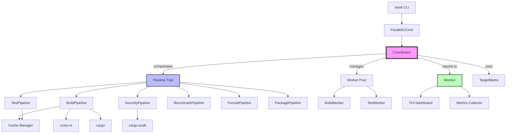
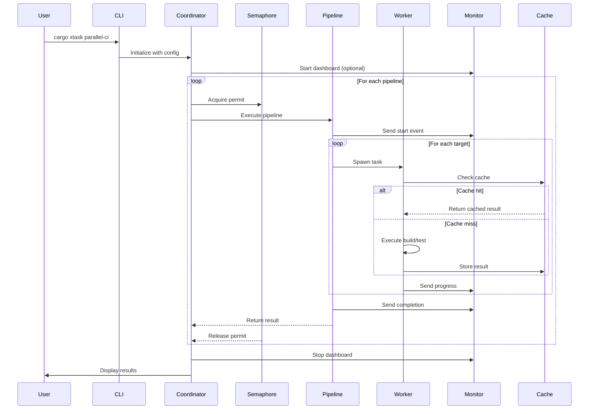
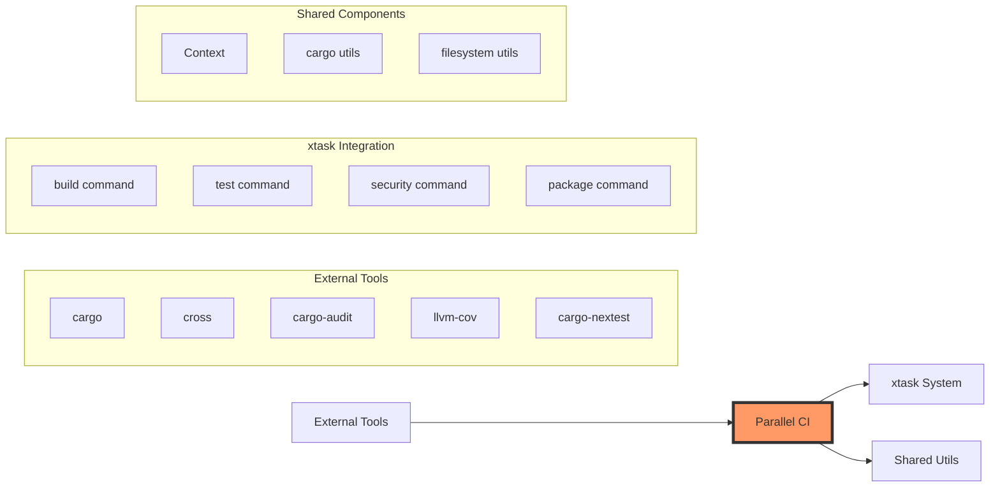
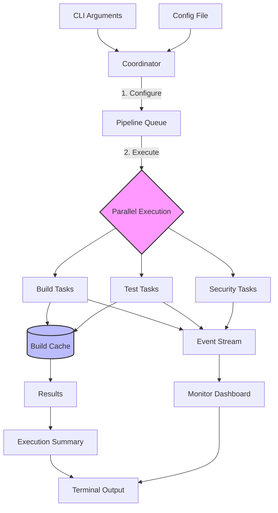

# KindlyGuard Parallel CI System Architecture Analysis

## Overview

The parallel CI system in KindlyGuard is a sophisticated, massively parallel CI/CD pipeline designed to maximize hardware utilization by running builds, tests, and security scans simultaneously across multiple OS targets.

## Directory Structure

```
xtask/src/commands/parallel_ci/
├── mod.rs              # Main module entry point and CLI interface
├── coordinator.rs      # Tokio-based orchestration engine
├── targets.rs          # Cross-platform target matrix
├── pipelines/
│   ├── mod.rs          # Pipeline trait definition
│   ├── build.rs        # Multi-target build pipeline
│   ├── test.rs         # Parallel test execution
│   ├── security.rs     # Security scanning pipeline
│   ├── benchmark.rs    # Performance benchmarking
│   ├── format.rs       # Code formatting checks
│   └── package.rs      # Binary packaging
├── workers/
│   ├── mod.rs          # Worker pool management
│   ├── build_worker.rs # Build task execution
│   └── test_worker.rs  # Test task execution
├── monitor/
│   ├── mod.rs          # Monitoring interface
│   ├── dashboard.rs    # Real-time TUI dashboard
│   └── metrics.rs      # Performance metrics collection
└── cache/
    └── mod.rs          # Build cache management
```

## Component Dependency Graph



## Pipeline Architecture



## Key Components Analysis

### 1. **Coordinator** (`coordinator.rs`)
- **Purpose**: Central orchestration engine
- **Key Features**:
  - Tokio-based async execution
  - Semaphore-based parallelism control
  - Fail-fast mode support
  - Real-time monitoring integration
  - Dynamic pipeline configuration
- **Dependencies**: `tokio`, `dashmap`, `num_cpus`

### 2. **TargetMatrix** (`targets.rs`)
- **Purpose**: Cross-platform build target management
- **Supported Targets**:
  - Linux x64/ARM64
  - macOS x64/ARM64
  - Windows x64
  - WASM32
- **Features**:
  - Automatic platform detection
  - Custom target specification
  - Target validation

### 3. **Pipeline Trait** (`pipelines/mod.rs`)
- **Purpose**: Abstraction for all CI/CD tasks
- **Interface**:
  ```rust
  trait Pipeline: Send + Sync {
      fn name(&self) -> &str;
      fn task_count(&self, targets: &TargetMatrix) -> usize;
      async fn execute(...) -> Result<String>;
      fn parallel_safe(&self) -> bool;
      fn priority(&self) -> u32;
  }
  ```

### 4. **Monitor System** (`monitor/`)
- **Purpose**: Real-time progress tracking
- **Components**:
  - TUI Dashboard (ratatui-based)
  - Metrics collection
  - Event streaming
  - Progress visualization

## Integration Points



## Data Flow



## File Importance Ranking

### Critical Files (Core Functionality)
1. **`coordinator.rs`** - Central orchestration logic
2. **`pipelines/mod.rs`** - Pipeline trait definition
3. **`mod.rs`** - CLI interface and entry point
4. **`targets.rs`** - Cross-platform target management

### Important Files (Pipeline Implementations)
5. **`pipelines/build.rs`** - Build pipeline (cross-compilation)
6. **`pipelines/test.rs`** - Test execution pipeline
7. **`pipelines/security.rs`** - Security scanning
8. **`monitor/dashboard.rs`** - Real-time progress UI

### Supporting Files
9. **`workers/build_worker.rs`** - Build task execution
10. **`workers/test_worker.rs`** - Test task execution
11. **`cache/mod.rs`** - Build cache management
12. **`monitor/metrics.rs`** - Performance metrics

## Performance Characteristics

- **Parallelism**: Uses CPU count as default max parallelism
- **Semaphore Control**: Prevents resource exhaustion
- **Async/Await**: Tokio-based for efficient I/O
- **Caching**: Reduces redundant builds/tests
- **Fail-Fast**: Optional early termination on failure

## Security Considerations

- **Sandboxed Execution**: Each pipeline runs in isolation
- **Dependency Auditing**: Integrated cargo-audit
- **Cross-Compilation**: Secure cross toolchain usage
- **Result Validation**: All outputs are verified

## Usage Examples

```bash
# Run full parallel CI
cargo xtask parallel-ci

# Run with specific targets
cargo xtask parallel-ci --targets linux-x64,macos-arm64

# Run with dashboard
cargo xtask parallel-ci --dashboard

# Run smoke tests only
cargo xtask parallel-ci --smoke-tests

# Run with custom parallelism
cargo xtask parallel-ci --max-parallel 8

# Fail fast on first error
cargo xtask parallel-ci --fail-fast
```

## Future Enhancement Opportunities

1. **Distributed Execution**: Support for remote build agents
2. **Incremental Builds**: More sophisticated caching
3. **Pipeline Templates**: Reusable pipeline configurations
4. **Metrics Export**: Prometheus/Grafana integration
5. **Container Support**: Docker-based isolation
6. **GPU Acceleration**: For applicable workloads