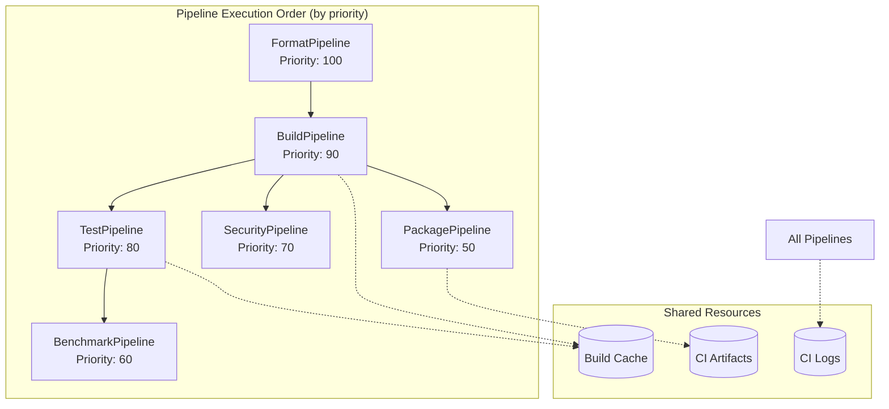
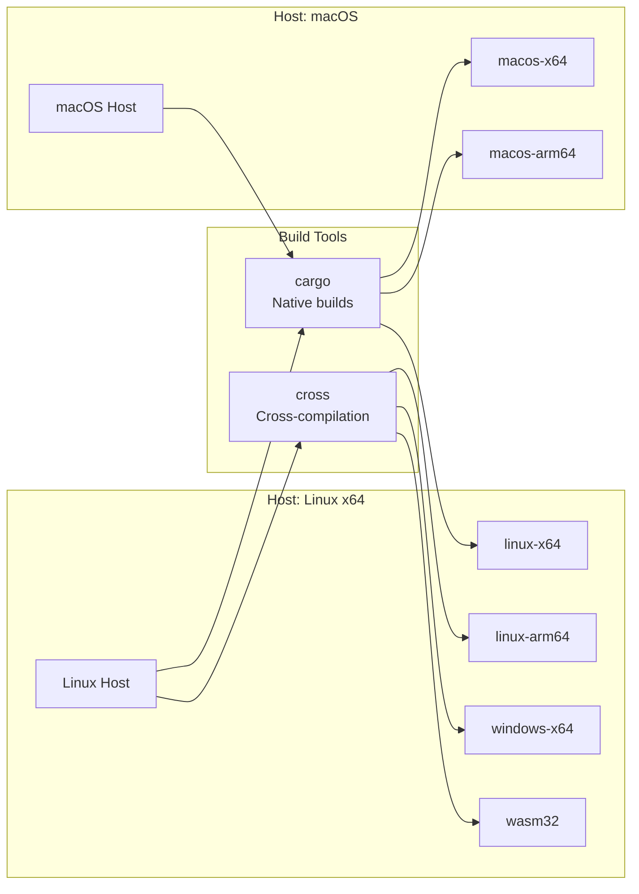
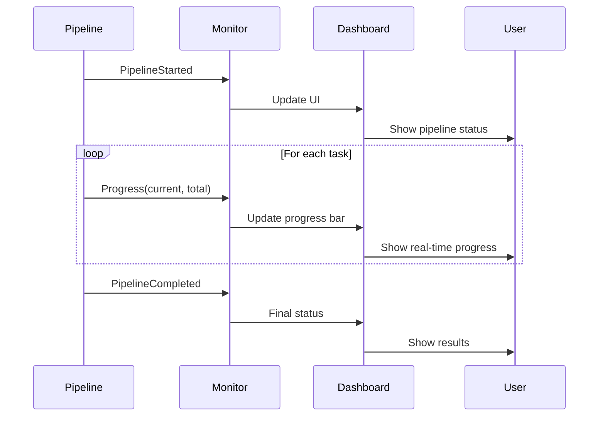
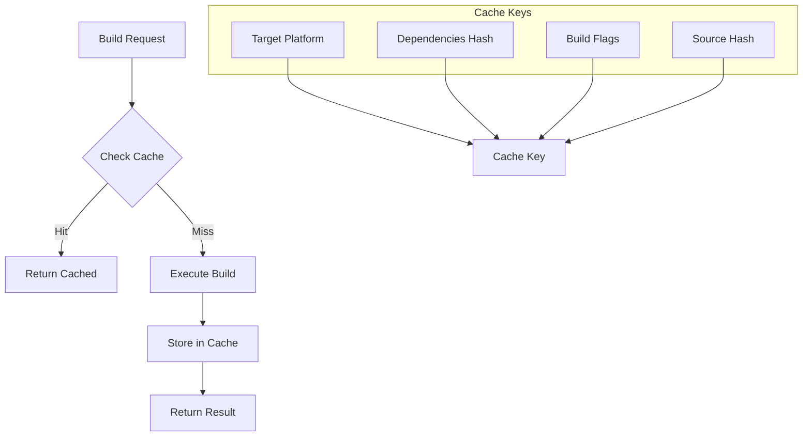
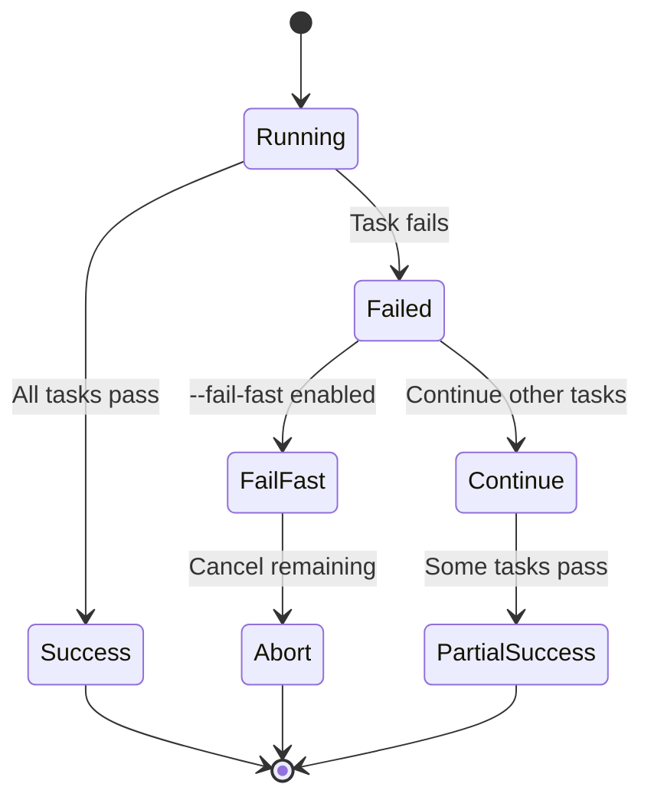

# Parallel CI Pipeline Analysis

## Pipeline Hierarchy and Dependencies



## Pipeline Capabilities

| Pipeline | Parallel Safe | Targets | Dependencies | Output |
|----------|---------------|---------|--------------|---------|
| Format | ✓ | All | None | Formatting report |
| Build | ✓ | Platform-specific | cargo/cross | Binaries |
| Test | ✓ | Platform-specific | Build artifacts | Test results |
| Security | ✓ | All | cargo-audit, semgrep | Security report |
| Benchmark | ✗ | Current platform | Build artifacts | Performance metrics |
| Package | ✓ | Platform-specific | Build artifacts | Distribution packages |

## Cross-Compilation Matrix



## Pipeline Implementation Details

### 1. Format Pipeline
```rust
// Checks code formatting across all workspace members
// Priority: 100 (runs first)
// Commands: cargo fmt --check
```

### 2. Build Pipeline
```rust
// Cross-compiles for all target platforms
// Priority: 90
// Features:
// - Automatic cross/cargo selection
// - Platform-specific optimizations
// - Incremental compilation support
// - Cache integration
```

### 3. Test Pipeline
```rust
// Runs tests with different profiles
// Priority: 80
// Modes:
// - Smoke tests (quick subset)
// - Full suite (all tests)
// - Platform-specific tests
// Uses: cargo test, cargo nextest
```

### 4. Security Pipeline
```rust
// Security scanning and auditing
// Priority: 70
// Tools:
// - cargo audit
// - cargo deny
// - semgrep rules
// - Unicode security checks
```

### 5. Benchmark Pipeline
```rust
// Performance benchmarking
// Priority: 60
// Note: Not parallel-safe (exclusive CPU access)
// Uses: cargo bench, criterion
```

### 6. Package Pipeline
```rust
// Creates distribution packages
// Priority: 50
// Outputs:
// - Platform-specific binaries
// - Archives (tar.gz, zip)
// - Checksums
// - Signatures
```

## Event Flow and Monitoring



## Cache Strategy



## Error Handling and Recovery



## Integration with xtask System

The parallel CI system integrates seamlessly with other xtask commands:

1. **Shared Context**: Uses the same `Context` struct for configuration
2. **Utility Functions**: Leverages common cargo and filesystem utilities
3. **Configuration**: Respects global xtask configuration
4. **Logging**: Unified logging and output formatting
5. **Error Handling**: Consistent error types and handling

## Performance Optimizations

1. **Semaphore-based Concurrency Control**
   - Prevents resource exhaustion
   - Configurable parallelism limit
   - Fair scheduling across pipelines

2. **Async/Await Architecture**
   - Non-blocking I/O operations
   - Efficient task scheduling
   - Minimal overhead

3. **Smart Caching**
   - Content-based cache keys
   - Platform-specific caches
   - Automatic cache invalidation

4. **Incremental Builds**
   - Dependency tracking
   - Minimal rebuilds
   - Workspace-aware optimization